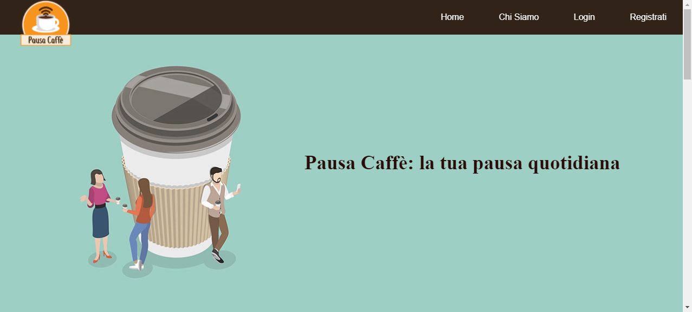
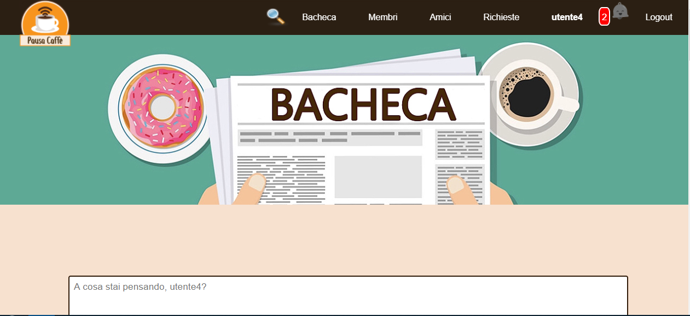
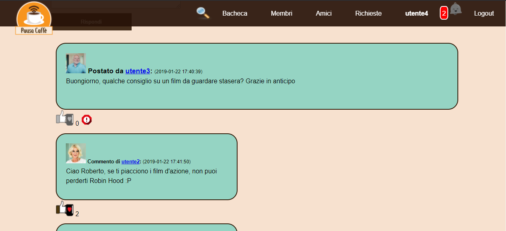
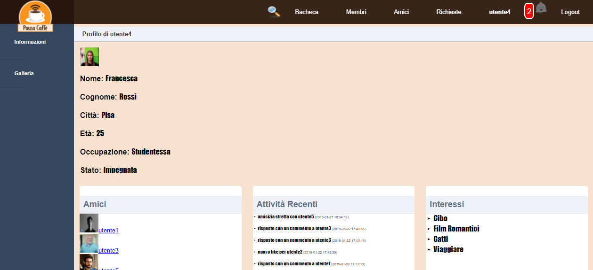
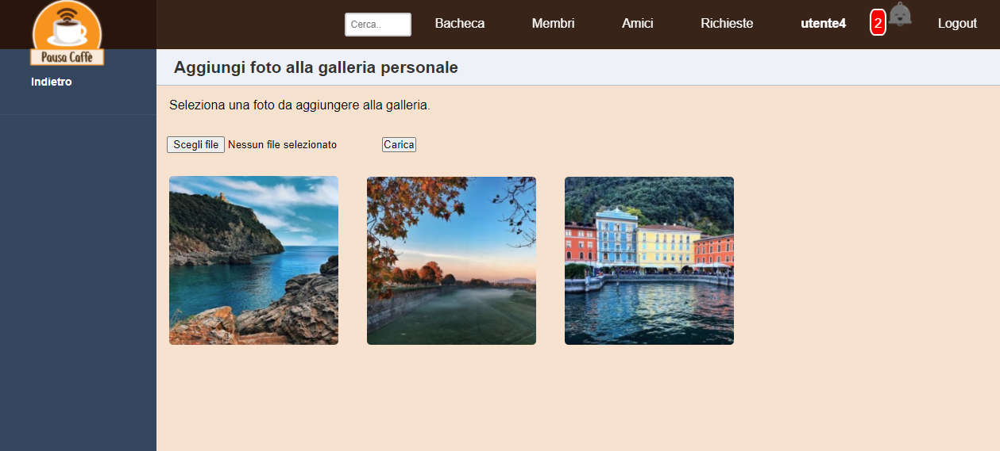

"Pausa Caffè" is an open-source social network platform written in pure HTML, CSS, JS, PHP with a MySQL database. This project was developed as part of the 'Web Development' exam during my Bachelor's degree. The goal was to demonstrate the basic architecture of a PHP-based web application. Please note that all the code and comments on git are in Italian.

## Features 🔍

### Home Page
- **Feed Viewing**: See all updates from your contacts and your own posts, arranged chronologically from most recent to least recent.
- **Interactive Actions**: Engage with content posted by friends through comments and likes.
- **Content Reporting System**: Report inappropriate content for system administrator review.
- **Navigation Bar**: Access different sections of the site, search for profiles within or outside your friend circle through the navigation bar at the top.

### User Profile Page
- **Personal Information**: Displays name, surname, date of birth, city of residence, interests, and occupation.
- **Profile Picture**: Showcases the user's profile photo.
- **Friends List and Gallery**: View your friend's list and personal photo gallery.
- **Activity Summary**: A chronological summary of recent activities involving the user.

### Requests Page
- **Friendship Management**: Manage incoming friendship requests and view the status of sent requests.

### Notifications System
- **Real-Time Updates**: Receive reminders whenever someone interacts with you, like receiving likes, comments on your posts, or when friendship requests are confirmed.

### Admin Login
- **Administration Panel**: From the main page, log in with administrator credentials to access site management tools.
  - **Report Management**: Decide the fate of posts flagged as "inappropriate" or delete them or keep them on the site.
  - **System Maintenance**: Manage database and delete obsolete data.
  - **Data Analysis**: Analyze user data, featuring statistics such as the city with the most registered users and the usernames of the most active users in the last week.

## Live Demo 🌍
You can view a live demo of the portfolio site mockup at the following link:
[Portfolio Demo](https://pausacaffesocial.altervista.org/index.php) 
Note: It's not possible to register new users for the moment, so you can try loggin in with one of the following toy account:
* username: utente2 | password: utente2
* username: utente3 | password: utente3 
* username: utente4 | password: utente4

(note: site doesn't fit on mobile, check it on laptop/desktop!) 

## Screenshots 📸
Here are some screenshots illustrating the social network site:

