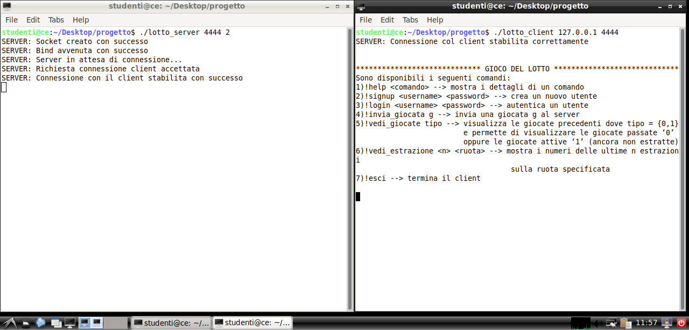

This project consists in a C implementation of the classic lottery game. Developed as a simple multi-client shell application, it allows users to engage in lottery games from their command-line interface.
The game operates through a server-client model, supporting multiple connections simultaneously, which makes it a great tool for learning about network programming and concurrency in C.

This project was originally develop for the course 'Computer Networks' in BSc Computer Engineering at University of Pisa.

## 🎯 Features and Capabilities
This application simulates the lottery game in real-time:
- **Multiplayer Interaction:** Players from different terminals can join the game, place bets, and participate in scheduled lottery draws.
- **Real-Time Updates:** The game server handles all client requests and updates all participants with the latest game status, results of lottery draws, and their betting outcomes.

### 📈 Engaging Game Mechanics
Participants can:
- **Sign Up and Log In:** Secure access ensures that players can return to their profiles and view their game history.
- **Bet Placement:** Users can place bets on numbers across various cities, experimenting with different betting strategies.
- **Real-Time Results:** The lottery draws are conducted at user-defined intervals, with immediate feedback provided to all active participants.

## Setup and Installation ⚙️
To get this game running on your own pc, follow the steps described at my GitHub repo [Here](https://github.com/enricollen/C-multiclient-online-lottery-game). 
(if you enjoyed this content please consider leaving a star ⭐)

## Screenshots 📸
Here is a screenshot illustrating the client and server interaction:

