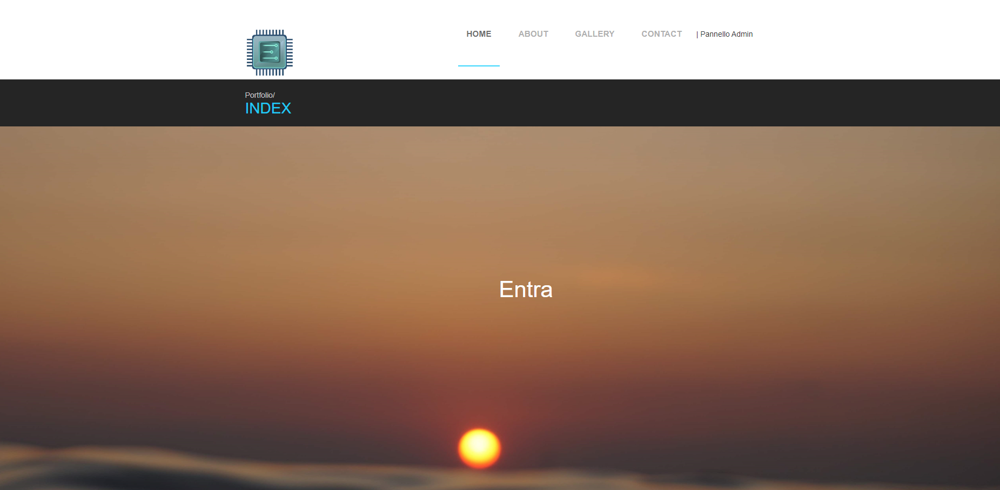
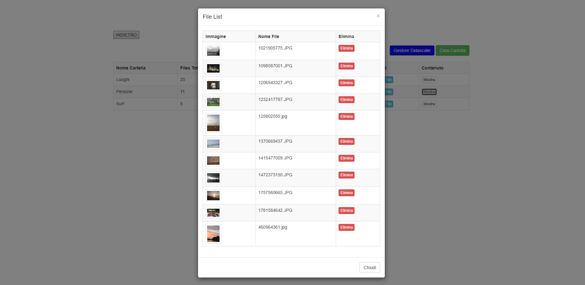

This project i developed back in the days showcase a ready-to-go mockup for an image portfolio site, designed to showcase your personal image/photography content effectively. 
The site is built using pure HTML, CSS, JavaScript, PHP, and MySQL. 

Key features include:
- **Admin Panel** 🔐: Secure admin panel to manage content with default username/password as `admin/admin`. It is highly recommended to change these default credentials immediately after initial setup by editing values in the "admin" MySQL table.
- **Image Folder Manager** 🗂️: A custom tool to manage, edit, delete, and upload photos efficiently.
- **Image Caption Manager** 📝: Let you manage captions for images, making it easier to update and maintain descriptive text associated with each photo.

## Live Demo 🌍
You can view a live demo of the portfolio site mockup at the following link:
[Portfolio Demo](https://enricollen.altervista.org/index.php) 

## Setup and Installation ⚙️
To get this portfolio site running on your own server, follow the steps described at my GitHub repo [Here](https://github.com/enricollen/Portfolio-image-gallery-HTML-CSS-JS-PHP-MySQL). 
(if you enjoyed this content please consider leaving a star ⭐)

## Screenshots 📸
Here are some screenshots illustrating the portfolio site:

