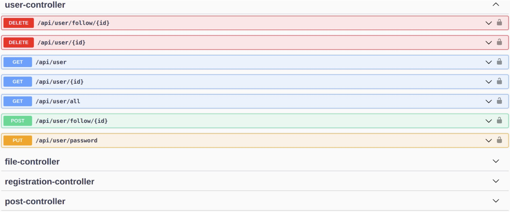

MappIt is an application that allows users to discover new places to visit and share their adventures and experiences, helping creators to promote their contents on the community.

MappIt is based on the client-server paradigm and the designed and implemented in detail the **server** part.

## 🏛️ Architecture
Below is reported the SW architecture:

MappIt was deployed on a cluster of three servers, each responsible for a different part of the service:

1. **Server A**: Runs the Java backend of the service and is part of the MongoDB cluster.
2. **Server B**: Runs the Neo4j server and is part of the MongoDB cluster.
3. **Server C**: Runs the data population periodic scripts and is part of the MongoDB cluster.

## 🔑 Key Features
- **Post New Visits**: Share your journeys to various points of interest.
- **Find New Places**: Discover new places to visit using filters like distance or popularity.
- **Interact with Other Users**: Engage with posts from other explorers.
- **Advanced Search**: Use various filters to find specific posts and places.

## 🔧 Service Implementation
The implementation of this project focused mainly on two aspects:

1. **Backend of the Service**:
   - APIs of the service
   - Database structure
   - Business logic

2. **Data Population**:
   - Scripts that exploited external APIs and services to add places and posts in the databases of the service

### 🗂️ API Development with OpenAPI and Swagger
In order to develop our APIs with the OpenAPI Specification, we decided to exploit the open-source tool set **Swagger**. Swagger is an Interface Description Language for describing RESTful APIs expressed using JSON, which helped us generate an OpenAPI document based on the code itself, adding an extra GUI for easier navigation through the endpoints:

Here is an example of the json response when looking for a place to visit nearby. It contains several info like the localization, an associated picture, users' posts talking about it, YT video link etc. :

### 💼 Development Aspects
The development of this service included many different aspects of software engineering and service design such as:

- Java application packages organization
- Java application databases connection handling
- Service endpoints
- Functional requirements
- Non-Functional requirements
- Database queries analysis by means of the Operation Frequency Table
- Indexes on certain collections and documents attributes to improve the performance of frequent queries
- Database sharding: Proposed based on the country code of places and users to ensure higher service availability
- Cross-database consistency management

## 🔗 GitHub Repository
Visit the project repository [here](https://github.com/Ruggero1912/MappIt) for project documentation and access to the codebase and project documentation.

(if you enjoyed this content, please consider leaving a star ⭐).