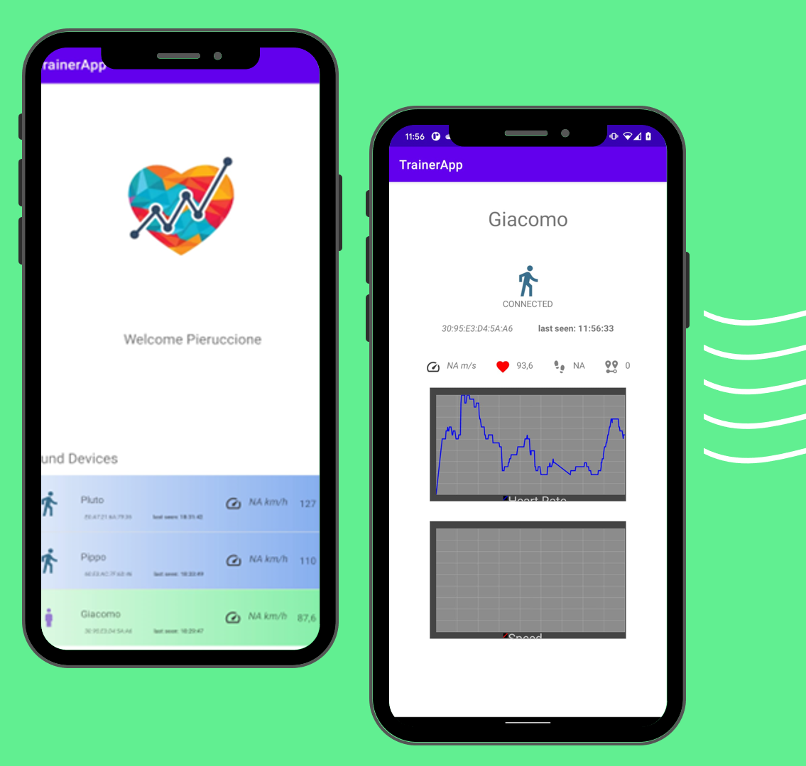
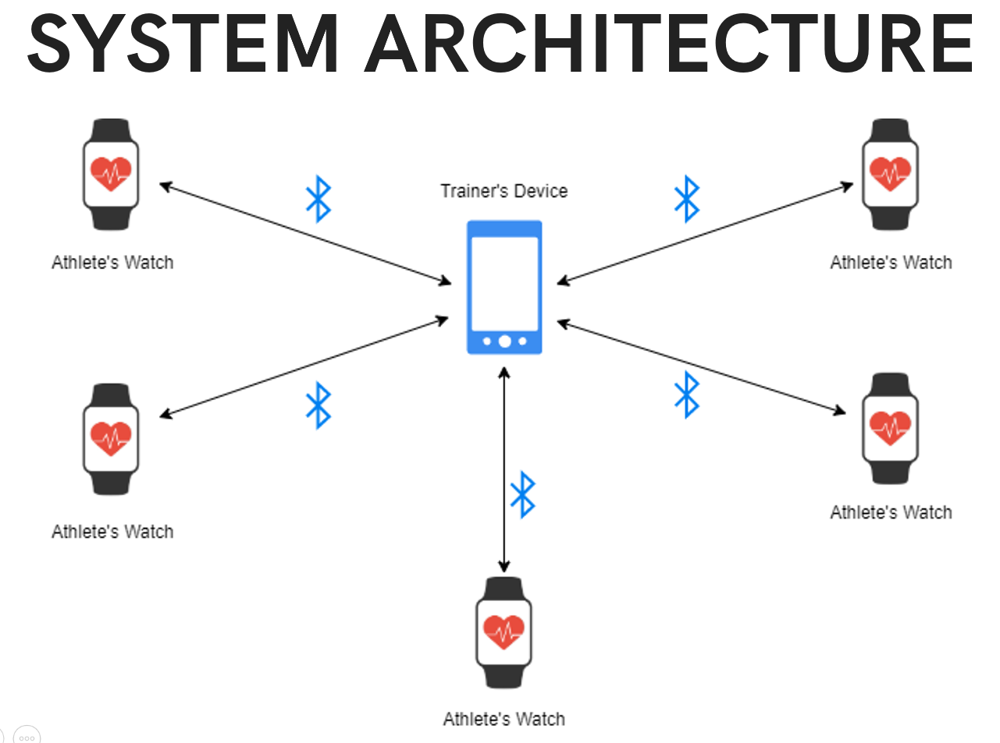
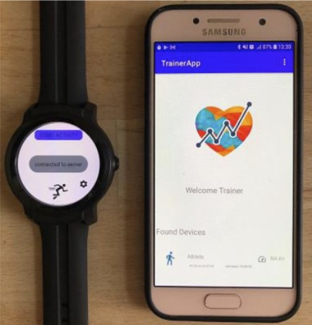
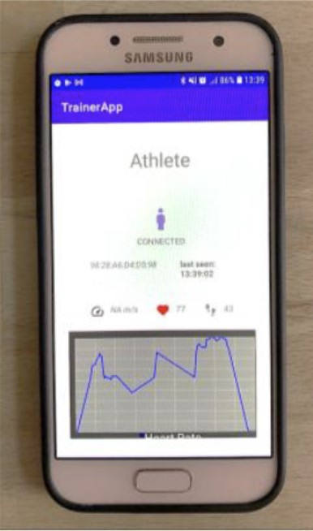
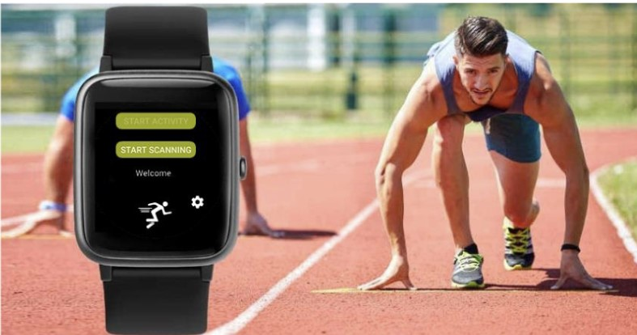

TrainAround is an Android app designed to let trainers control the training status of a group of athletes. Unlike existing workout tracking apps that run on smartphones and have limitations in accurately sensing user activities, TrainAround operates on wearable devices. These wearables are less uncomfortable, more precise in measuring training status, and equipped with a variety of sensors.

Current workout tracking solutions often face the following issues:
- Smartphones are inconvenient for accurate activity sensing when not attached to the body.
- Wearable apps typically track a single user, making real-time monitoring of multiple athletes by a trainer challenging.
- Existing apps that connect users to personal trainers usually provide asynchronous updates, lacking real-time monitoring capabilities.
- Dependence on internet connectivity for real-time monitoring.

## 💡Solution: TrainAround
TrainAround addresses these problems by creating a service that allows trainers to monitor the training status of multiple athletes in real-time without requiring an internet connection. The app collects data from multiple Wear OS smartwatches and displays it on a central Android device used by the coach or trainer.

This project was originally developed for the course 'Mobile & Social Sensing Systems' in MSc in Artificial Intelligence & Data Engineering at University of Pisa.

## 📌Key Features

1. **Wearable Device Integration**:
   - Athletes wear a WearOS watch with the TrainAround-client app installed and running.
   - The trainer uses an Android phone or tablet to control the training status of the athletes in real-time.
   - Utilizes Wear OS smartwatches for accurate and precise measurement of training metrics.
   - Eliminates the need for athletes to carry smartphones during workouts.

2. **Real-Time Monitoring**:
   - Establishes a local area network (LAN) between a central Android device and multiple Wear OS devices using BLE star topology.
   - Enables trainers to monitor multiple athletes simultaneously in real-time.

3. **Internet Independence**:
   - Designed to function without internet connectivity, making it suitable for use in remote areas or locations without Wi-Fi access.

4. **Group Supervision**:
   - Shifts the focus from 1:1 monitoring (athlete self-checking statistics) to one-to-many monitoring (trainer supervising multiple athletes).

## 🏗️ System Architecture 

The network architecture focuses on connecting the smartwatches to the coach's smartphone (central hub) using a Bluetooth Low Energy (BLE) Star Topology Network. This solution was chosen for its:
- **Compatibility**: Works seamlessly with Wear OS devices and Android smartphones.
- **Versatility**: Suitable for various training environments and conditions.
- **Simplicity**: Easy to set up and use without extensive technical knowledge.
- **Energy Efficiency**: Optimized to conserve battery life on wearable devices.

## 📊 Gathered Data

TrainAround collects various data points from the athletes, including:
- **Step Counter**: Using the built-in sensor.
- **Heart Rate**: Using the built-in sensor.
- **Speed**: Using GPS.
- **Distance**: Using GPS.
- **Pace**: Using GPS, defined as time/distance.
- **Activity Recognition**: Using the Activity Recognition API to determine the state of the athlete (Still, Walking, Running).

## 🔗 GitHub Repository
Visit the project repository [here](https://github.com/Ruggero1912/TrainAround) for accessing the codebase 

(if you enjoyed this content, please consider leaving a star ⭐).

## 📸 Screenshots

Here are some screenshots illustrating the app in action:

