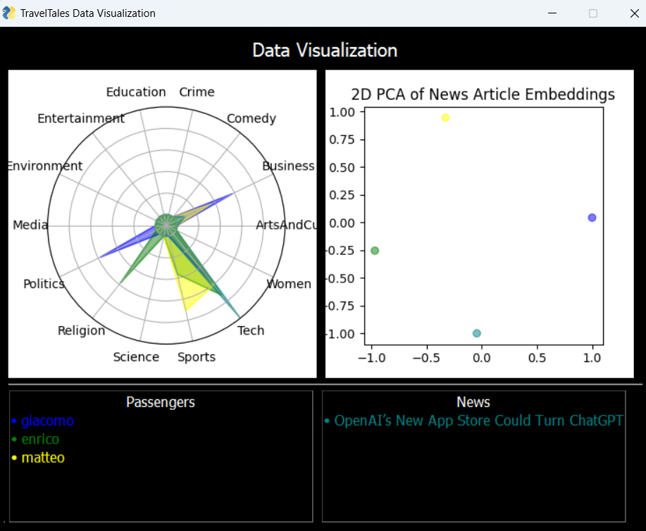
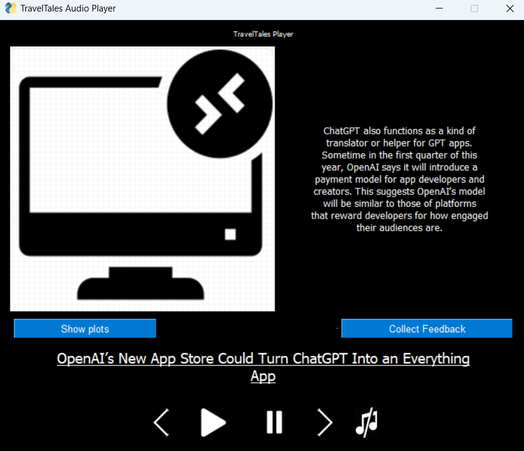
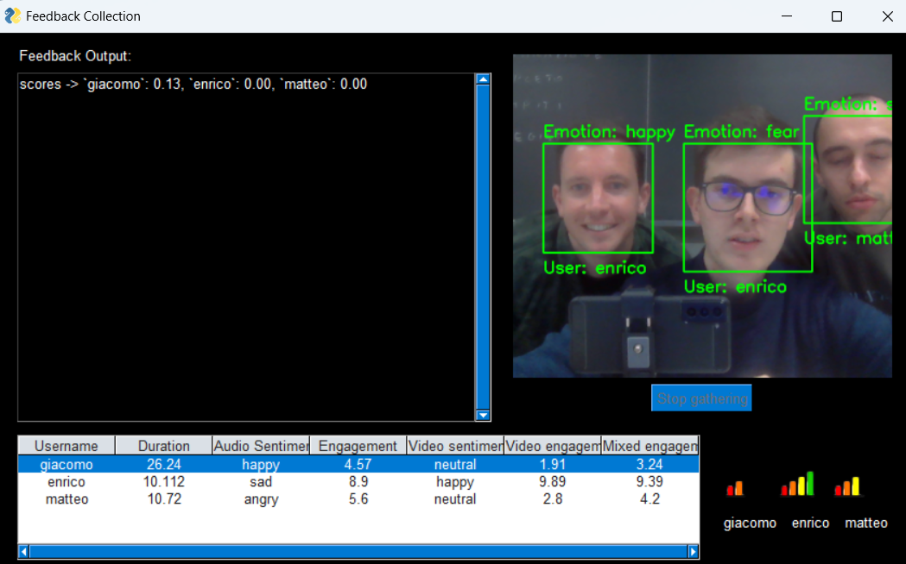

Consider the situation in which you are traveling with other people who have different interests, and you do not know what to talk about. You could play some radio news or listen to pop music, but maybe you and the others share some common interests in specific topics. It would be great to discover these interests and talk about them!

This project was originally develop for the course 'Industrial Applications' in MSc in Artificial Intelligence & Data Engineering at University of Pisa.

## What is TravelTales?
TravelTales is a service designed to stimulate conversations between people in a shared space, specifically developed for in-car usage. The main characteristic of TravelTales is its ability to understand people’s preferences and propose news that closely match the interests of the passengers.

**News Crawling and Indexing**
The service fetches news from various websites and generates summaries for each of them. These summaries are then indexed according to the topics covered in the news. For each news summary, the system uses a Text-to-Speech (TTS) model to produce a synthesized audio version.

**News Suggestion**
Whenever a TravelTales client instance is active, it loads the most interesting news for the group recognized as currently onboard. The retrieval system accesses the passengers' interests and ranks the most relevant news. The audio file of the top news is then played by the client system.

**Users Interests Adaptation**
After proposing the news, the system gathers feedback by estimating engagement levels using audio and video features from each user. It can recognize who is speaking, their vocal emotions, and the facial expressions of each passenger during the feedback gathering phase.

## 🏗️ Implementation Components
For this project, my collegues and I implemented the following modules:
1. **News Crawler**: Fetches news from various websites and generates summaries.
2. **TTS Model**: Converts text summaries into synthesized audio.
3. **Retrieval System**: Loads and ranks news based on passenger interests.
4. **Engagement Estimator**: Gathers and analyzes audio and video feedback to adapt user interests.

## 🔗 GitHub Repository
Visit the project repository [here](https://github.com/enricollen/TravelTales) for accessing the codebase 

(if you enjoyed this content, please consider leaving a star ⭐).

## 🛠️ Setup and Local Deployment
### Server
Implemented in Flask, the server handles user registration, audio processing, news suggestions, and feedback:

1. Firstly, you have to install ffmpeg codec at this link: `https://www.gyan.dev/ffmpeg/builds/`
- For windows installation you can type in the powershell: `winget install "FFmpeg (Essentials Build)"`

2. Run the server.py script from the /Server directory.

### Client 
1. Start by registering a new user:
- open a web browser and visit: `https://server_ip_addr:5000`

2. Run the client.py script from the /Client directory.

## Screenshots 📸
Here is a screenshot illustrating the GUI interface:

## 📹 Demo Video
Watch the demo videos below to see TravelTales in action.

1) User registration:

2) News Player:

3) Data Visualization:

4) Feedback gathering demo with face recognition and explicit user feedback store system:

