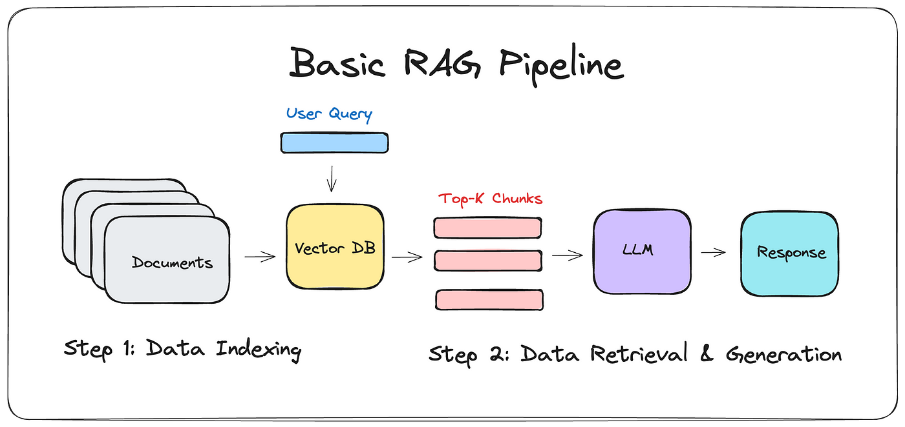

In this project, i wanted to recreate a local Retrieval-Augmented Generation (RAG) chatbot that can answer to questions by acquiring information from personal pdf documents.
##  What is Retrieval-Augmented Generation (RAG)?
<div style="text-align: center;">

</div>
Retrieval-Augmented Generation (RAG) is a technique that combines the strengths of information retrieval and natural language generation. In a RAG system, a retriever fetches relevant documents or text chunks from a database, and then a generator produces a response based on the retrieved context.

1. **Data Indexing**
- Documents: This is the starting point where multiple documents are stored.
- Vector DB: The documents are processed and indexed into a Vector Database.

2. **User Query**
- A user query is input into the system, which interacts with the Vector Database.

3. **Data Retrieval & Generation**
- Top-K Chunks: The Vector Database retrieves the top-K relevant chunks based on the user query.
- LLM (Large Language Model): These chunks are then fed into a Large Language Model.
- Response: The LLM generates a response based on the relevant chunks.

## 🏗️ Implementation Components
For my project, i exploited the following components to build the RAG architecture:
1. **Chroma**: A vector database used to store and retrieve document embeddings efficiently.
2. **Flask**: Framework for rendering web page and handling user interactions.
3. **Ollama**: Manages the local language model for generating responses.
4. **LangChain**: A framework for integrating language models and retrieval systems.

## 🔗 GitHub Repository
Visit the project repository [here](https://github.com/enricollen/rag-conversational-agent) for accessing the codebase (if you enjoyed this content please consider leaving a star ⭐).

## 🛠️ Setup and Local Deployment
1. **Download and install Ollama on your PC**:
   - Visit [Ollama's official website](https://ollama.com/download) to download and install Ollama. Ensure you have sufficient hardware resources to run the local language model.
   - Pull a LMM of your choice:
   ```sh
    ollama pull <model_name>  # e.g. ollama pull llama3:8b
    ```

2. **Clone the repository and navigate to the project directory**:
    ```sh
    git clone https://github.com/enricollen/rag-conversational-agent.git
    cd rag-conversational-agent
    ```

3. **Create a virtual environment**:
    ```sh
    python -m venv venv
    source venv/bin/activate  # On Windows, use `venv\Scripts\activate`
    ```

4. **Install the required libraries**:
    ```sh
    pip install -r requirements.txt
    ```

5. **Insert you own PDFs in /data folder**

6. **Run the application:**
    ```sh
    python app.py
    ```

6. **Navigate to `http://localhost:5000/`**

7. **Perform a query** 

## 🚀 Future Improvements
Here are some ideas for future improvements:
- [ ] Add OpenAI LLM GPT model compatibility
- [ ] Add web scraping in case none of the personal documents contain relevant info w.r.t. the query

## 📹 Demo Video
Watch the demo video below to see the RAG Chatbot in action:
[](https://www.youtube.com/watch?v=Khjp7j-0qVQ)

The demo was run on my PC with the following specifications:
- **Processor**: Intel(R) Core(TM) i7-14700K 3.40 GHz
- **RAM**: 32.0 GB
- **GPU**: NVIDIA GeForce RTX 3090 FE 24 GB

## Screenshots 📸
Here are some screenshots illustrating the chat:


