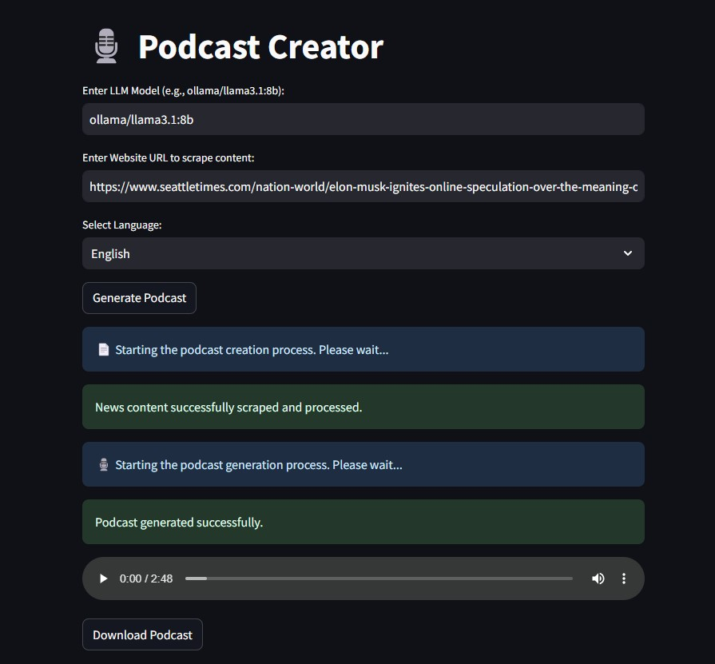

We increasingly hear about AI Agents — i usually say that we have entered what is being called the "Agentic Spring", a phase where trends are shifting towards developing autonomous, specialized AI rather than all-knowing generalist assistants.

For this reason, I decided to explore the emerging frameworks that are rapidly gaining traction, testing their potential, understanding how they work and what these agentic frameworks can achieve.

I wanted to test their capabilities on a non-trivial use case. So, I decided to implement a **podcast generation system that extracts content from a website and transforms it into a structured audio narrative**. I took inspiration from Google’s Notebook LM, simulating a similar workflow where AI agents analyze and structure content before converting it into a narrated podcast.

For this project in particular i implemented a **fully local agentic podcast creation pipeline** utilizing:
- [Ollama](https://ollama.com/) to run local LLMs.
- [CrewAI framework](https://www.crewai.com/) for the AI Agent orchestration.
- [Coqui TTS](https://github.com/coqui-ai/TTS) for audio generation.
- [Streamlit](https://streamlit.io/) for creating an interactive web UI.

The application automates the entire workflow of transforming news content from a website into a structured podcast with narration. Additionally, this project highlights how to enable interaction between two distinct crews within CrewAI, making it a versatile example for adapting to other use cases involving multiple collaborating crews.

---
## 🛠️ How It Works
Below i reported the overall schema of the Agentic Crews and Agents:


### Step 1: Provide a News URL
The user inputs a news URL. This URL becomes the starting point for scraping and processing content.

### Step 2: News Processing Crew
The **News Processing Crew** handles:
1. **Scraping:** Extracting and cleaning the main content from the website.
2. **Reporting:** Generating a detailed report based on the scraped content.

### Step 3: Podcast Creation Crew
The **Podcast Creation Crew** takes the processed content and performs:
1. **Script Writing:** Crafting a structured podcast script in Italian (or whatever language do you prefer).
2. **Audio Generation:** Converting the script into an audio file (MP3) using Coqui TTS.

### Step 4: Save Results
- The **scraped content** is saved locally for traceability.
- The **podcast audio** is saved as an MP3 file in the `podcasts` directory.

---

## 🧩 Components and Interactions
There are 2 Crews that interact with each other: **News Processing Crew** and **Podcast Creation Crew**:
### 1. 👥 News Processing Crew
This crew focuses on extracting and analyzing content from the provided URL.

#### **Agents**
- **Website Content Scraper:** 
  - Role: Extract the main content of the specified website URL.
  - Tools: Uses the `ScrapeWebsiteTool` for efficient web scraping.
  - Output: Cleaned and relevant content in Italian.

- **Senior Reporting Analyst:** 
  - Role: Analyze the scraped content and generate a detailed report.
  - Skills: Expertise in turning complex data into clear, actionable reports.

#### **Tasks**
1. **Scrape Website Content:**
   - Description: Extract and clean the main content from the specified website.
   - Expected Output: A full report with the main topics in Italian.

2. **Content Reporting:**
   - Description: Analyze the scraped content and expand each topic into a detailed section or provide key insights for multiple topics.
   - Expected Output: A detailed report in Italian with approximately six paragraphs.


### 2. 👥 Podcast Creation Crew
This crew converts processed content into a podcast script and generates the final audio file.

#### **Agents**
- **Podcast Script Writer:** 
  - Role: Convert the processed content into a structured and engaging podcast script.
  - Output: A natural, dialogue-based script in Italian.

- **Audio Producer:** 
  - Role: Generate high-quality MP3 audio from the podcast script.
  - Tools: Uses a custom defined tool that exploits Coqui TTS for local text-to-speech synthesis.
  - Output: An MP3 file of the podcast narration.

#### **Tasks**
1. **Script Writing:**
   - Description: Create a structured podcast script based on the processed content.
   - Expected Output: A podcast script in Italian with a single speaker.

2. **Audio Generation:**
   - Description: Convert the podcast script into an MP3 audio file.
   - Expected Output: A high-quality MP3 file (`podcasts/podcast_{timestamp}.mp3`).

---
## 🎛️ A UI Podcast Creator
To make this project even more accessible, I also developed a UI-based version using Streamlit, allowing users to interact with the system in a more intuitive way. Instead of running commands manually, users can simply enter the required details in a web-based interface and generate a podcast effortlessly:


### Key Features of the UI Version:
✅ User-friendly Interface: A web-based UI powered by Streamlit for easy interaction.

✅ Customizable Inputs: Users can specify the local LLM model, enter a news URL, and select their preferred language.

✅ Automated Workflow: The system scrapes, processes, and generates podcasts.

✅ Instant Audio Playback & Download: The generated podcast is available for immediate playback and download directly from the UI.

---

## 📁 Project Structure

```plaintext
.
├── src/
│   ├── podcast_creator_from_url_ollama_coquiTTS/
│   │   ├── tools/
│   │   │   └── text_to_speech_tool.py  # Coqui TTS integration for audio generation
│   │   └── main.py                     # main script
|   |   └── streamlit_app.py            # UI version
│   └── ...
├── output/
│   ├── scraped_news.txt                # Saved content from the news scraping task
├── podcasts/
│   └── podcast.mp3                     # Generated podcast audio file
├── voices/                             # Contains the reference wav files for voice cloning
└── README.md                           # Project documentation
```
---
## 🚀 How to Run

1. **Install FFmpeg**:

   - Download FFmpeg from the [official FFmpeg website](https://ffmpeg.org/download.html) or use a package manager suitable for your operating system.
   - Add FFmpeg to your system's PATH:
     - **Windows**: Add the `bin` directory of FFmpeg to your system's environment variables under the `Path`.
     - **Linux/MacOS**: Install FFmpeg using a package manager (e.g., `apt install ffmpeg` on Ubuntu or `brew install ffmpeg` on macOS) and ensure it's accessible in the terminal.
   - Verify installation:
     ```bash
     ffmpeg -version
     ```
     If the command outputs the version details, FFmpeg is correctly installed and configured.

2. Make sure **Ollama is running** on your system and to have some local LLM downloaded.
3. **Clone the repository**:
   ```bash
   git clone https://github.com/enricollen/AIAgents
   cd crewAI/podcast_creator_from_url_ollama_coquiTTS
   ```
4. **Create and activate a virtual environment to manage dependencies**:
   ```bash
   python -m venv venv
   source venv/bin/activate   # On Linux/MacOS
   venv\Scripts\activate      # On Windows
   ```
5. **Install required dependencies**:
   ```bash
   pip install -r requirements.txt
   ```
6. Create a .env file in the project root path (see .env_example for reference) and configure environment variables:
   ```plaintext
   LLM_MODEL=llama3.1:8b
   WEBSITE_URL=https://example.com/news-article
   ```
7. Run the CLI version of the app:
   ```python
   cd src/podcast_creator_from_url_ollama_coquiTTS
   python main.py
   ```
   or the UI version:
   ```python
   cd src/podcast_creator_from_url_ollama_coquiTTS
   python streamlit_app.py
   ```

   ## 🔗 GitHub Repository
Visit the project repository [here](https://github.com/enricollen/AIAgents/tree/main/crewAI/podcast_creator_from_url_ollama_coquiTTS) for accessing the codebase (if you enjoyed this content, please consider leaving a star ⭐).

## 🎧 Podcast Demo  
Below there are a couple of demos of the final podcast audio, created in English and Italian respectively:  

<audio controls>
  <source src="../../assets/audio/podcast_creator/podcast_eng.wav" type="audio/mpeg">
  Your browser does not support the audio element.
</audio>


<audio controls>
  <source src="../../assets/audio/podcast_creator/podcast_ita.wav" type="audio/mpeg">
  Your browser does not support the audio element.
</audio> 

## Screenshots 📸
Here is a screenshot illustrating the UI version of the app:

