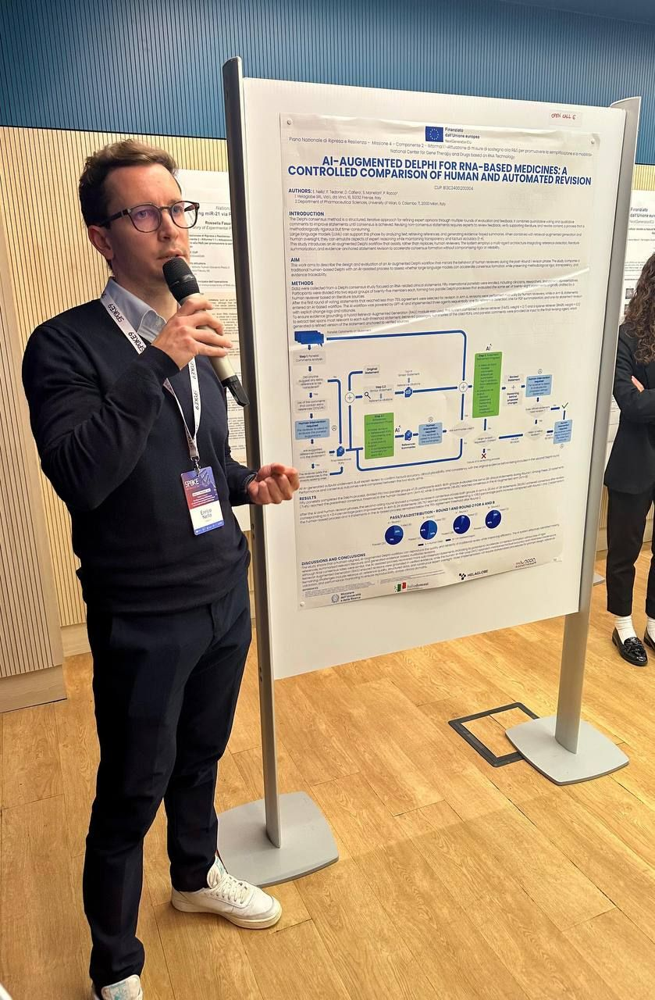
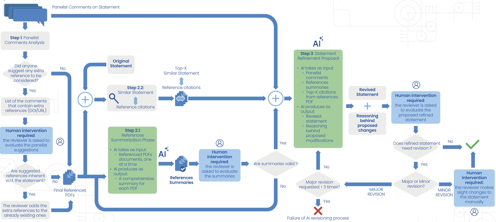
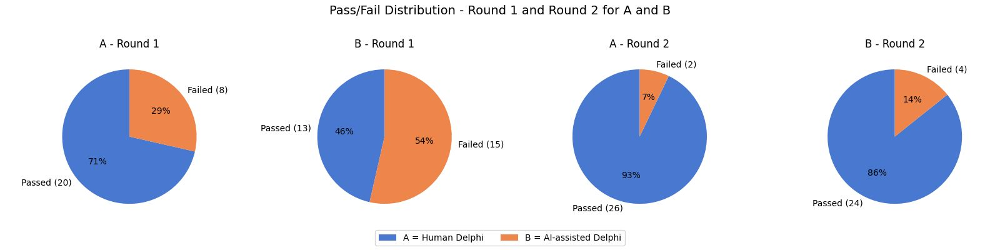
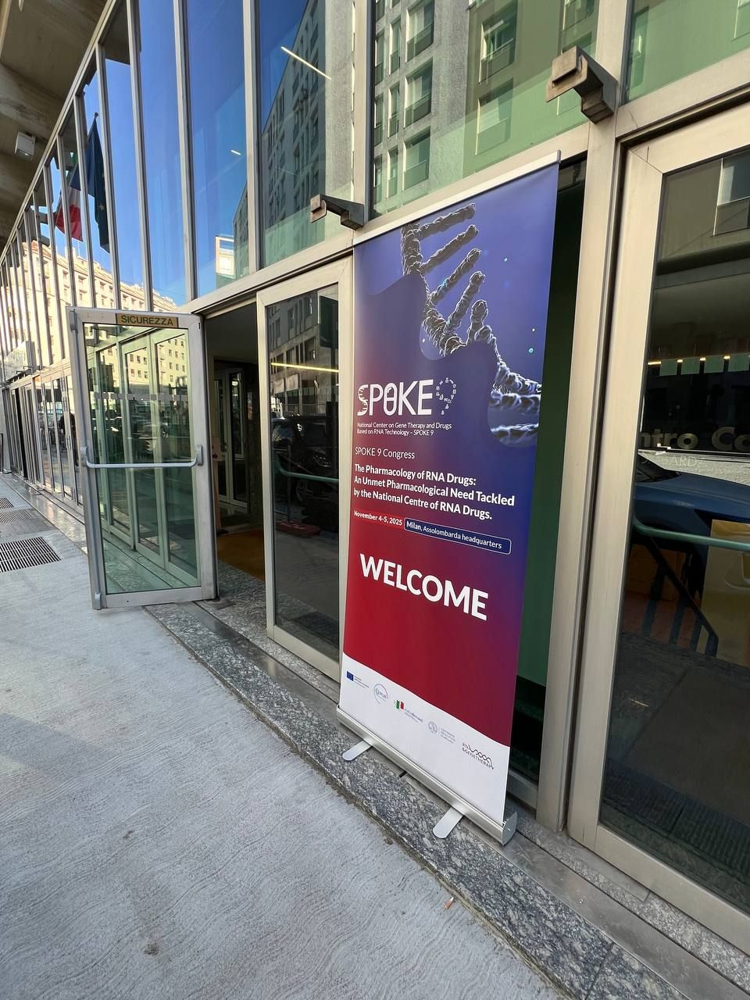
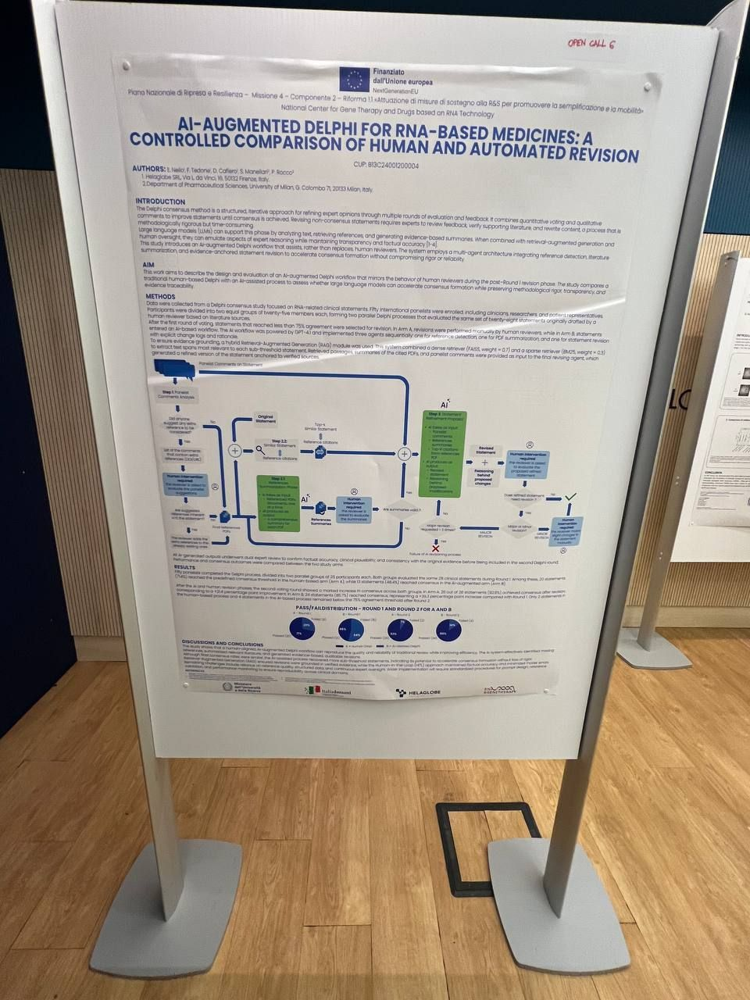
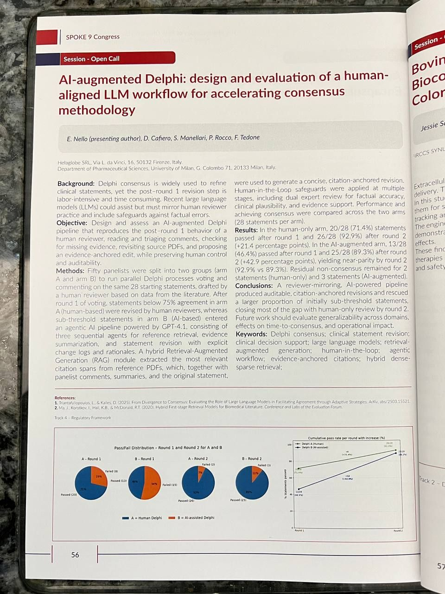
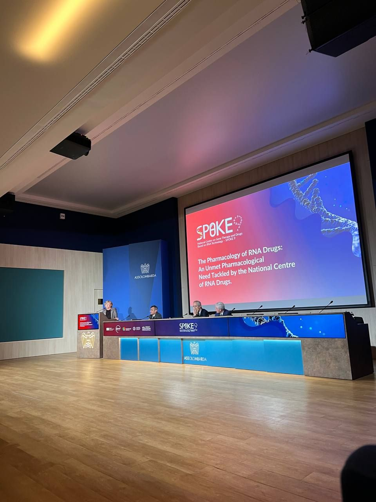

our work **"AI-Augmented Delphi: Design and Evaluation of a Human-Aligned LLM Workflow for Accelerating Consensus"** was selected for a **poster presentation** at the [Spoke 9 Congress](https://www.rna-genetherapy.eu/spokes/spoke-9/) — *"The Pharmacology of RNA Drugs: an Unmet Pharmacological Need Tackled by the National Centre of RNA Drugs"*, held in Milan on November 4–5, 2025 at the beautiful Assolombarda center.

  

---

# 🎯 The Work

developed at **[Helaglobe](https://www.helaglobe.com/)**, the study introduces an AI-assisted workflow for the **Delphi consensus process**, applied to the field of RNA-based therapeutics — a fast-growing area that brings both exciting opportunities and new regulatory and safety challenges.

> **what is the Delphi consensus method?**
> - a panel of experts independently rates a set of statements
> - results are aggregated and shared with the group
> - statements that don't reach agreement are revised and re-evaluated in successive rounds
> - widely used in clinical guidelines, medical research, and policy
> - the bottleneck: the revision phase is slow and demanding — experts must review feedback, verify literature, and rewrite statements by hand

the core question we set out to answer: can a multi-agent AI system replicate the quality of human expert revision in a Delphi process, while accelerating consensus formation?

---

# 🧪 Methods

fifty international panelists — clinicians, researchers, and patient representatives — were split into two parallel groups of 25, each evaluating the same 28 clinical statements in a controlled Delphi process:

- **arm A** — traditional human-led revision
- **arm B** — AI-assisted revision under expert supervision

after round 1, statements that failed to reach the 75% agreement threshold were selected for revision. in arm B, the AI workflow — powered by **GPT-4.1** — ran three sequential agents:

1. **reference detection agent** — identifies missing or relevant citations
2. **PDF summarization agent** — extracts and summarizes supporting literature
3. **statement revision agent** — generates evidence-anchored rewrites with explicit change logs and rationale

to ensure evidence grounding, a **hybrid RAG module** combined a dense retriever (FAISS, weight 0.7) and a sparse retriever (BM25, weight 0.3). all AI-generated outputs underwent **dual expert review** before entering round 2 — a human-in-the-loop approach to maintain factual accuracy and clinical plausibility.

  

---

# 📊 Results

  

| | round 1 consensus | round 2 consensus | improvement |
|---|---|---|---|
| **arm A** — human Delphi | 71% (20/28) | 93% (26/28) | +21.4 pp |
| **arm B** — AI-assisted Delphi | 46% (13/28) | 86% (24/28) | **+39.3 pp** |

the AI-assisted workflow recovered significantly more sub-threshold statements (+39.3 percentage points), closely matching expert-level performance while substantially speeding up the revision process. only 4 statements in arm B and 2 in arm A remained below threshold after round 2.

---

# 💡 Key Takeaways

- **AI can closely match expert performance** in structured consensus workflows when properly supervised
- **retrieval-augmented generation** is key: grounding revisions in verified evidence prevents hallucinations and ensures auditability
- **human-in-the-loop** is not optional — it's what makes the system trustworthy and deployable in clinical settings
- the approach is domain-agnostic and could be extended to any Delphi process beyond RNA therapeutics
- remaining challenges: reference quality dependency, structured data requirements, and continuous expert oversight

---

# 🙏 Thanks

thanks to everyone who made this work possible: **Davide Cafiero**, **Fabio Tedone**, **Elena Caproni**, and **Lucia Politi**, and to the [Helaglobe](https://www.helaglobe.com/) team.

this research was supported by the **Piano Nazionale di Ripresa e Resilienza (PNRR)** — within the *National Center for Gene Therapy and Drugs based on RNA Technology*, in collaboration with the Department of Pharmaceutical Sciences, University of Milan.

---

## 📸 Photos

  
  
  
  

