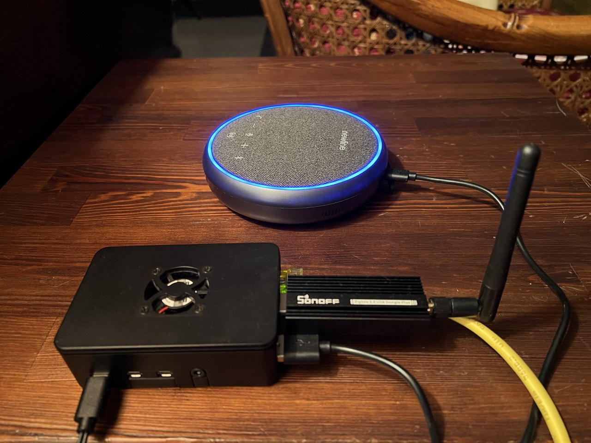

<div align="center">
  
</div>

After building my [fastrtc voice agent](https://enricollen.github.io/posts/AI-Voice-Agent/) powered by **[llamaindex](https://www.llamaindex.ai/)** for agent orchestration, i realized i wanted something more practical for everyday use at home. i wanted to replace my alexa device with a fully customizable, privacy-focused voice assistant that could run locally on my raspberry pi.

the main limitation of the original web-based version was that it required opening a browser and clicking buttons to interact. for a true hands-free experience at home, i needed **wake word detection** and **direct audio i/o** without any ui dependency.

# 🎯 Project Goals

the goal was simple but ambitious: create a fully functional voice assistant that:
- runs on a raspberry pi 4 (4gb ram)
- activates on a custom wake word (i chose "hey pamirca")
- works without any web interface
- handles both microphone input and speaker output through a single usb audio device
- maintains all the flexibility of the original project (multiple stt/tts/llm providers)

# 🔄 From Web UI to Wake Word Detection

the main differences from my previous fastrtc voice agent are:

| feature | original project | raspberry pi version |
|---------|-----------------|---------------------|
| interface | web-based (gradio/custom ui) | terminal-only, no ui |
| activation | button click | wake word detection |
| audio i/o | browser microphone | direct usb audio device |
| deployment | desktop/laptop | raspberry pi 4 |
| use case | development/testing | always-on home assistant |
| conversation flow | manual start/stop | automatic timeout handling |

# ⚙️ How It Works

the system operates in two distinct modes:

## 1. **wake word listening mode** (idle state)
- continuously listens for the wake word "hey pamirca"
- uses efficient hotword detection model (eff-word-net)
- minimal cpu usage while waiting
- instant activation when wake word detected

## 2. **conversation mode** (active state)
- activates automatically when wake word is detected
- plays greeting ("dimmi" - italian for "tell me")
- records voice input until silence is detected
- transcribes speech using configured stt provider
- processes request through llm agent with tool access
- generates natural speech response via tts
- plays audio response through speaker
- continues listening for follow-up questions
- automatically exits after timeout or exit phrase

## Conversation Flow Example
```
[system boots] → [listening for wake word]
  ↓
[user says "hey pamirca"] → [wake word detected]
  ↓
[plays greeting "dimmi"] → [conversation active]
  ↓
[user asks question] → [stt transcription]
  ↓
[llm processes + uses tools if needed] → [generates response]
  ↓
[tts synthesis] → [plays audio response]
  ↓
[continues listening] → [timeout or exit phrase]
  ↓
[back to wake word listening mode]
```

# Key Components

### 1. **wake word detector**
- uses **eff-word-net** library with resnet50 model
- custom wake word trained reference file
- configurable detection threshold (default 0.65)
- handles microphone stream management
- releases audio device when conversation starts

### 2. **direct audio conversation handler**
- manages pyaudio streams for input/output
- implements voice activity detection (vad)
- records until silence detected
- mutes microphone during ai response playback
- handles conversation timeout automatically
- supports exit phrases ("goodbye", "arrivederci", etc.)

### 3. **speech services** (unchanged from original)
- **stt providers**: elevenlabs, groq, openai, whisper (local)
- **tts providers**: elevenlabs, kokoro (local)

### 4. **llm agent framework** (unchanged from original)
- **[llamaindex](https://www.llamaindex.ai/)** react agent for orchestration
- supports multiple llm providers via **[litellm](https://www.litellm.ai/)**:
  - cloud: openai, google gemini, groq, openrouter
  - local: ollama
- tool calling capabilities (weather, time, lights, mcp tools, search)
- conversation memory management with configurable history limits

### 5. **audio device management**
- automatic usb audio device detection
- prioritizes pulseaudio for device sharing
- automatic volume adjustment
- uses `aplay` for reliable audio playback on raspberry pi

# 🛠️ Raspberry Pi Optimizations

running on a raspberry pi 4 required some optimizations:

## Hardware Considerations
- **usb audio device**: combined microphone + speaker
- **cooling**: recommended for sustained operation
- **power supply**: 5v 3a minimum for stability


# 🎤 Wake Word Detection

the wake word system uses **eff-word-net**, a lightweight neural network specifically designed for hotword detection on resource-constrained devices.

## Creating Custom Wake Word
1. record 3-5 samples of your chosen wake word
2. generate reference embeddings using eff-word-net tools
3. save as json reference file
4. configure threshold for sensitivity vs false positives

## My Configuration
```python
# wake word settings
wake_word = "hey_pamirca"
wake_word_threshold = 0.65  # lowered from 0.7 for better sensitivity
wake_word_ref_file = "hotword_refs/hey_pamirca/hey_pamirca_ref.json"

# conversation settings
conversation_timeout = 10  # seconds of silence before ending
exit_phrases = ["goodbye", "bye", "arrivederci", "ciao ciao", "stop", "exit"]

# audio settings
unmute_delay = 0.5  # seconds to wait after speaking before unmuting mic
input_buffer_size = 8000   # 500ms @ 16khz
output_buffer_size = 5000  # 312.5ms @ 16khz
```

the wake word threshold of 0.65 provides a good balance: sensitive enough to detect "hey pamirca" reliably, but not so sensitive that it triggers on similar-sounding phrases.

# 🔊 Audio Setup

one of the biggest challenges was getting reliable audio i/o on raspberry pi.

## Audio Playback Solution
initially tried pyaudio for playback, but faced buffer underrun issues on raspberry pi. switched to **aplay** command-line tool:
- writes audio to temporary wav file
- uses system's aplay for reliable playback
- automatic cleanup after playback
- supports any sample rate

## Microphone Muting
during ai response playback, the microphone is muted to prevent:
- echo/feedback loops
- ai responding to its own voice
- false wake word triggers

# 🤖 Agent Capabilities

the agent maintains all capabilities from the original project, powered by llamaindex's react agent framework.

## Pamirca's Personality

pamirca is configured with a friendly and helpful personality through a system prompt defined in `config/prompts.yaml`:

- responds exclusively in italian
- friendly and conversational tone
- audio-optimized responses (avoids special characters)
- always uses tools for real-time information (weather, time, news)
- never relies on stale knowledge for current events

the system prompt explicitly instructs pamirca to **always** use appropriate tools rather than answering from its training data, ensuring responses are accurate and up-to-date.

## Available Tools
- **weather tool**: get current weather and forecasts for any city
- **time tool**: provide current time and date
- **light control tool**: control smart lights via webhook
  - zones: sala, cucina, etc.
  - turn on/off lights per zone
- **web search tool**: search the web for current information
- **mcp tools**: model context protocol integration with fastmcp servers
  - **news summary**: get latest general news (via fastmcp)
  - **serie a news**: italian football/soccer news (via fastmcp)
  - **surf forecast**: wave and surf conditions (via fastmcp)

## 🏠 Home Automation Control

pamirca can control smart devices in different zones of the home through a webhook integration with n8n. the light control system supports different home zones.

### Light Control Commands
- **turn on**: "accendi le luci della sala" (turn on living room lights)
- **turn off**: "spegni le luci della cucina" (turn off kitchen lights)
- **specific zones**: works with any of the four configured zones

the light control tool sends commands to an n8n webhook that interfaces with your smart home system, making it easy to integrate with any home automation platform.

## 🌐 MCP Integration for Extended Features

beyond home automation, pamirca leverages **model context protocol (mcp)** via **fastmcp** servers to provide additional capabilities:

### FastMCP-Powered Tools
- **news summary**: real-time general news updates from multiple sources
- **serie a news**: dedicated italian football/soccer news feed
- **surf forecast**: wave height, wind conditions, and surf forecasts for any coastal city

these mcp tools run on fastmcp cloud servers, providing reliable real-time data without local infrastructure requirements. the mcp architecture makes it easy to add new capabilities by simply connecting to additional fastmcp servers.

## Example Interactions
```
user: "hey pamirca"
assistant: "dimmi"

user: "accendi le luci della sala"
assistant: [uses light tool] "luci accese nella sala con successo"

user: "spegni le luci della cucina"
assistant: [uses light tool] "luci spente nella cucina con successo"

user: "che ore sono?"
assistant: [uses time tool] "sono le 15 e 30"

user: "che tempo fa a roma?"
assistant: [uses weather tool] "a roma ci sono 22 gradi celsius 
           con cielo sereno e vento leggero"

user: "dammi le ultime notizie"
assistant: [uses mcp news tool] "ecco un riassunto delle ultime notizie: 
           [summary of current news]"

user: "come sono le onde a Livorno?"
assistant: [uses mcp surf forecast tool] "a Livorno le onde sono 
           di circa 1 metro con vento da nord-ovest"

user: "arrivederci"
assistant: "arrivederci!"
[returns to wake word listening]
```

# 📺 Video Demo

to see pamirca in action, check out this demo video showcasing the wake word detection, voice interaction, and tool usage:

[](https://www.youtube.com/watch?v=x3XwKcdNpGw)

# 🎯 Use Cases
It's a perfect alexa replacement with more control and privacy:

## 1. **smart home control**
- voice-activated lights: "accendi le luci della sala" (turn on living room lights)
- webhook integration with n8n for extensibility
- natural language commands in italian

## 2. **customizable tools**
- weather forecasts
- web searches
- general knowledge questions
- contextual follow-up questions

## 3. **development platform**
- different stt/tts providers
- experiment with different llms
- develop custom tools and integrations
- prototype voice interfaces

# 🎬 Conclusion

transforming a web-based voice agent into a raspberry pi-powered home assistant was an incredibly rewarding project. it demonstrates that with the right tools and optimizations, you can build a privacy-focused, fully customizable voice assistant that rivals commercial solutions.

the key advantages over alexa:
- **privacy**: all data stays local if configured
- **customization**: unlimited tool integration
- **flexibility**: swap any component (stt/tts/llm)
- **transparency**: full control over system behavior
- **cost**: no subscription fees after initial setup

while commercial assistants offer convenience, the ability to customize every aspect of the interaction, maintain privacy, and extend functionality with custom tools makes this diy approach compelling for tech enthusiasts.