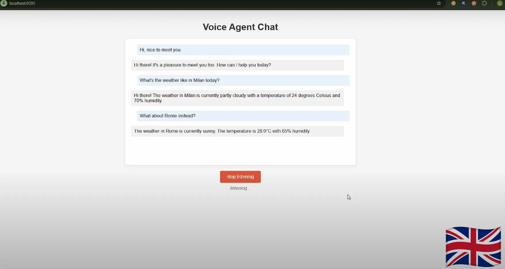

With the launch of the open-source library **[FastRTC](https://fastrtc.org/)** (late February 2025), developers gained a much easier way to build real-time audio applications. Released by [Hugging Face](https://huggingface.co/fastrtc), FastRTC was designed to simplify the development of WebRTC and WebSocket-based systems, even for those without specialized experience in real-time communication.

# Real-time: Now VS Then
Closed-source APIs like **OpenAI Realtime API** and **Gemini Live API** offer seamless speech-to-speech interaction, abstracting away the entire pipeline — from voice input to synthesized response. These services typically provide excellent performance and are easy to integrate, but they are **proprietary** and **require paid access**, limiting transparency and customizability.


In contrast, FastRTC represents a new generation of **open-source frameworks** that enable developers to build the entire voice interaction pipeline themselves — from speech recognition, to text processing, to speech synthesis. While it may require slightly more setup, FastRTC allows full control over each component (e.g., choosing your own LLM, STT and TTS engines), supports local deployment or cost-effective scaling, and introduces significant **speed advantages by reducing latency** across the pipeline. With FastRTC, it’s now possible to **replicate closely the speech-to-speech loop of closed-source APIs** using entirely open tools:


In this post, I will show how to i managed to build a model-agnostic voice-enabled AI assistant that can engage in natural conversations. The project combines FastRTC for real-time communication, multiple speech services, and LiteLLM for flexible model support. 

The goal is to demonstrate how to create a streaming voice interface in Python using FastRTC’s built-in features — such as automatic voice activity detection, turn-taking, and Gradio UI — combined with your own backend logic or AI agent.

Whether you’re building a voice chatbot, a hands-free assistant, or a prototype for real-time AI interaction, this example can help you get started quickly with FastRTC.

# ⚙️ How it Works
1. The system captures your voice input
2. Converts speech to text using your configured STT provider
3. Sends the text to your configured LLM via LiteLLM
4. Converts the response to speech using your configured TTS provider
5. Plays back the audio response

# 🏗️ Architecture

Here’s an overview of the architecture i used:


The project follows a modular class-based design with multiple components working together to provide a seamless voice interaction experience:

1. **FastRTC**: Handles real-time voice communication
2. **Speech Services**:
- **STT** (Speech-to-Text): Supports ElevenLabs, OpenAI, Groq, and local Whisper
- **TTS** (Text-to-Speech): Supports ElevenLabs and local Kokoro TTS
3. **LiteLLM**: Provides unified access to multiple LLM providers:
- OpenRouter
- Google Gemini
- OpenAI
- Groq
- Local Ollama
4. **Agent Framework**: A Llamaindex ReAct agent orchestrates the conversation flow with:
- Weather Tool integration (example)
- Memory management

# 🛠️ Agent Configuration
Here comes the fun (& powerful) part: you can plug in as many tools as you like and tailor them to your exact needs. The voice agent can call these external utilities on demand — empowering the LLM to go beyond text and tackle structured tasks like fetching weather, make reservations, or anything else you want to!

The agent can be configured through environment variables and YAML files:

## System Prompts
Located in ```config/prompts.yaml```:

```yaml
system_prompts:
  weather_expert: |
    You are a helpful weather expert assistant...
  chef_assistant: |
    You are a knowledgeable cooking assistant...
```

## Tools Configuration
The agent supports various tools that can be enabled/disabled.

Example tool configuration:
```python
tools = [
    {
        "name": "get_weather",
        "description": "Get current weather in a location"
    }
]
```

## Memory Settings
The agent implements a memory mechanism that let it remember the conversation history: 
```json
MEMORY_TOKEN_LIMIT=4000        # Total memory token limit
CHAT_HISTORY_RATIO=0.8         # Ratio for chat history (80% of total)
```

# 📺 Voice Agent UI
Here are some screenshots of the UI interface:


# 📺 Video Demo:
To help understand how everything works together, i’ve included a quick demo showcasing the voice agent in action. I showed how the agent processes user input, optionally uses tools like the weather API, and converts responses into natural-sounding speech using one of the TTS providers. In the demo i tried different setups:

- **Demo 1**: STT → Elevenlabs | TTS → Elevenlabs | LLM → Gemini 1.5 Flash | Language → English
- **Demo 2**: STT → OpenAI GPT-4o-transcribe | TTS → Elevenlabs | LLM → Gemini 1.5 Flash | Language → Italian
- **Demo 3 (Fully local setup)**: STT → Whisper Large v3 turbo | TTS → Kokoro TTS | LLM → Ollama, Qwen 3 8b | Language → English

[](https://www.youtube.com/watch?v=fjYv0PuJT7k)

# 📖 Medium Tutorial
Visit the step-by-step tutorial i wrote in Medium [here](https://medium.com/thedeephub/fastrtc-voice-ai-agent-534aa8dec899) (if you enjoyed this content, please consider clapping the story 👏).

# 🔗 GitHub Repository
Visit the project repository [here](https://github.com/enricollen/fastRTC-voice-agent) for accessing the codebase (if you enjoyed this content, please consider leaving a star ⭐).