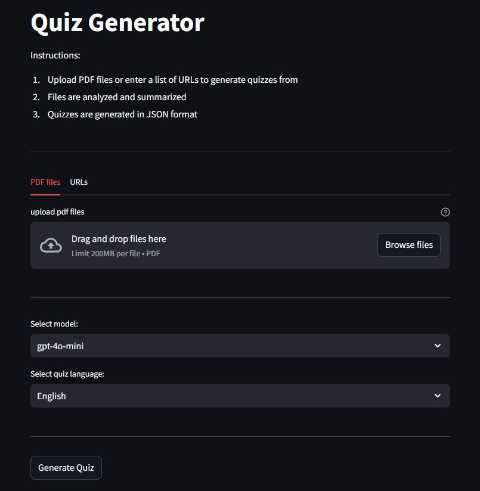
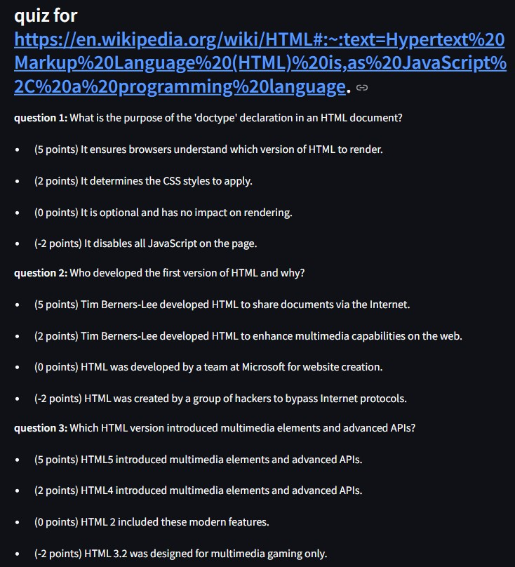

Recently OpenAI has released their [Agent SDK](https://openai.github.io/openai-agents-python/), so i decided to explor its potential to build something practical for education/learning porpouse.

This led me to create an **automated pipeline that turns educational content into structured quizzes**. The system accepts either **PDF files** or **web URLs**, processes them using agents, and outputs **multiple-choice questions** with a structured scoring system.

The goal? Support learning by extracting meaningful concepts and transforming them into a gamified quiz experience.

For this project, I built an agentic system with:
- Text extraction via `PyPDFLoader` and `WebBaseLoader`
- Concept summarization in the choosen language
- Agent-generated **quizzes with scoring**
- A **Streamlit-based UI** for user-friendly interaction

---

## 🛠️ How It Works

Below is an overview of the agent pipeline that powers the Quiz Maker:

### Step 1: Provide Input
The user uploads one or more **PDF documents** or pastes a list of **web URLs**.

### Step 2: Text Extraction
Content is extracted using:
- **PyPDFLoader** (for PDFs)
- **WebBaseLoader + Html2TextTransformer** (for web content)

### Step 3: Summarization
A **text summarizer agent** analyzes the extracted content and organizes the main concepts to serve as the knowledge base for quiz generation.

### Step 4: Quiz Generation
A **quiz generator agent** creates **10 multiple-choice questions**, each with:
- One correct answer (5 points)
- One partially correct answer (2 points)
- One incorrect answer (0 points)
- One misleading/harmful answer (-2 points)

### Step 5: Save Results
- Summarized content and raw text are saved in dedicated folders
- The final quizzes are saved in structured **JSON format**

### 💡 JSON Output Format

Each quiz is saved with this structure:

```json
{
  "questions": [
    {
      "theme": "question theme",
      "question_text": "Question text?",
      "answers": [
        { "text": "Correct answer", "score": 5 },
        { "text": "Partially correct answer", "score": 2 },
        { "text": "Incorrect answer", "score": 0 },
        { "text": "Misleading answer", "score": -2 }
      ]
    }
  ]
}
```

---

## 📺 Quiz Maker UI

Here are some screenshots of the Streamlit interface:



---

## 📁 Project Structure

```plaintext
quiz_maker/
├── raw_pdf_text/               # Extracted original text from PDFs
│   └── *.txt
├── summarized_pdf_text/        # Agent-generated summaries
│   └── *_summary.txt
├── json_question_answers/      # Final quizzes in JSON format
│   └── *_quiz.json
├── main.py                     # Main script
├── requirements.txt            # Required dependencies
├── .env_example                # Environment variable template
└── README.md                   # Documentation
```

---

## 🚀 How to Run

1. **Clone the repository**:
   ```bash
   git clone https://github.com/enricollen/AIAgents
   cd openAIAgents/quiz_maker
   ```

2. **Create and activate a virtual environment**:
   ```bash
   python -m venv venv
   source venv/bin/activate   # On Linux/MacOS
   venv\Scripts\activate      # On Windows
   ```

3. **Install required dependencies**:
   ```bash
   pip install -r requirements.txt
   ```

4. **Configure environment variables**:
   Rename the `.env_example` file in the project root and set your OpenAI key:
   ```plaintext
   OPENAI_API_KEY=your_openai_api_key
   ```

5. **Run the application**:
   ```bash
   streamlit run main.py
   ```

---

## 🔗 GitHub Repository
Visit the project repository [here](https://github.com/enricollen/AIAgents/tree/main/openAIAgents/quiz_maker) for accessing the codebase (if you enjoyed this content, please consider leaving a star ⭐).