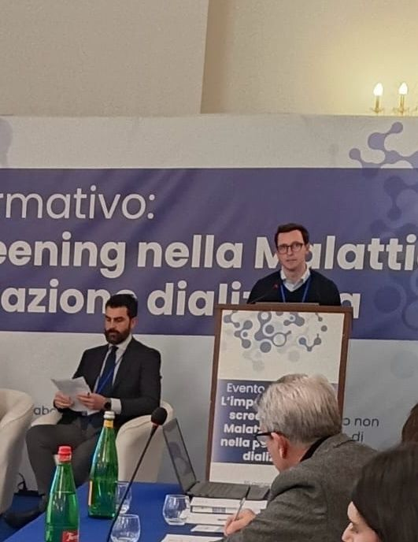
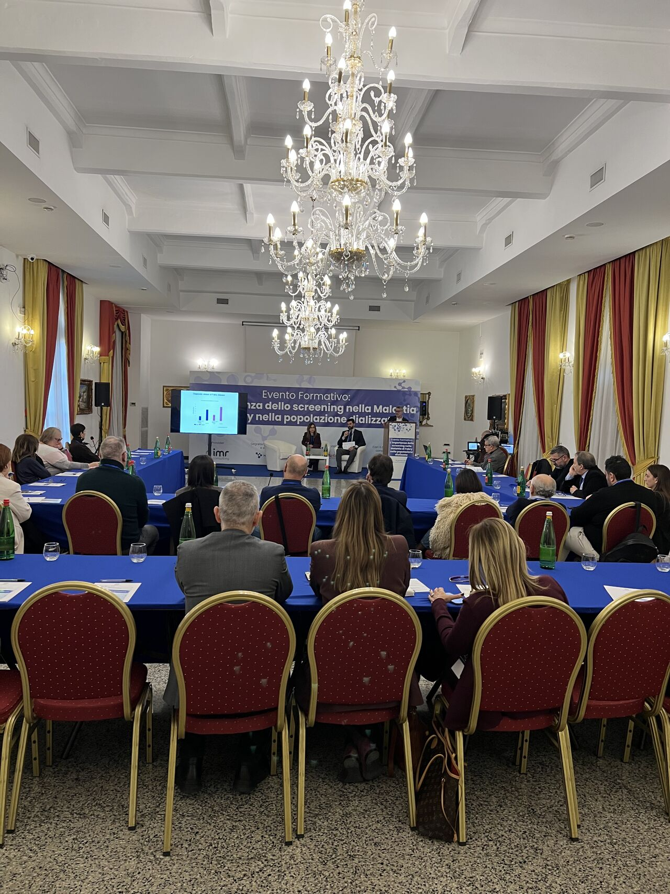
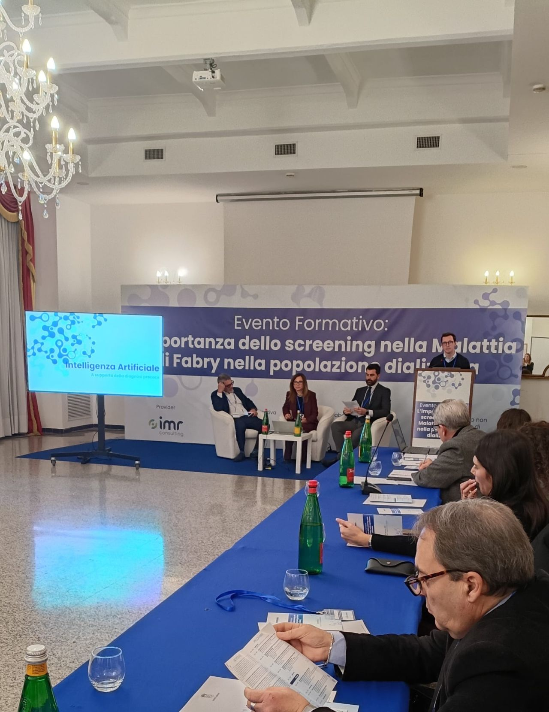
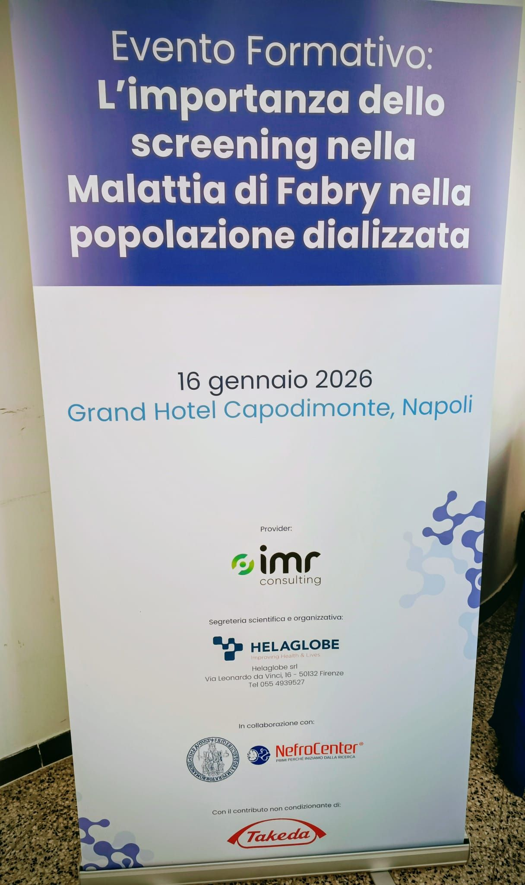

on january 16th i had the opportunity to speak in Naples at an ECM (continuing medical education) course dedicated to the screening of **Fabry Disease**, focusing on the role of artificial intelligence in supporting early diagnosis.

a multidisciplinary event bringing together nephrologists, biologists, nurses, and digital health experts — oriented towards innovation, data sharing, and improving care pathways.

the event was organized by [Italian Medical Research](https://www.italianmedicalresearch.it/) and [Helaglobe](https://www.helaglobe.com/).

  

---

# 🎯 The Talk

**"AI for Predictive Diagnosis"**

in a rare disease, every day of diagnostic delay matters. Fabry Disease is often underdiagnosed and identified late — and one of the most pressing needs is intercepting patients as early as possible to start treatment.

my intervention focused on how **AI can act as an ally** in this process: predictive algorithms integrated with territorial monitoring, capable of flagging at-risk patients without replacing the clinician — augmenting their diagnostic capacity instead.

the talk also touched on the challenge of **systematic screening in dialysis populations**, where signals of the disease can surface but risk going unread without the right tools and workflows in place.

---

# 🗂️ What We Covered

## the screening gap
why Fabry Disease is still largely missed in clinical practice, and the organizational — not just clinical — barriers that prevent timely diagnosis.

## AI-driven predictive models
how machine learning algorithms can be integrated into existing workflows to identify at-risk patients from routine clinical data, enabling proactive rather than reactive diagnosis.

## connecting the ecosystem
territorial dialysis centers and reference centers working together — because the challenge is as much about coordination and data sharing as it is about technology.

---

# 💡 Key Takeaways

- **early diagnosis saves lives** — in rare diseases like Fabry, delay directly impacts treatment outcomes
- **AI doesn't replace the clinician** — it enhances their ability to catch what might otherwise be missed
- **interoperability and data sharing** between centers are preconditions for any AI tool to work at scale
- **multidisciplinary collaboration** is essential: the best algorithms are useless without clinical buy-in and workflow integration

---

# 🙏 Thanks

thanks to **Antonio Pisani**, **Ersilia Satta**, and **Renata Rinaldi** for the scientific direction, and to the whole team — **Davide Cafiero**, **Tania Vuoso**, **Cinzia Diana** — for making this event happen.

it was a meaningful and inspiring day, and a strong reminder of why this kind of knowledge-sharing between technologists and clinicians matters so much.

---

## 📸 Photos

  
  
  
  

