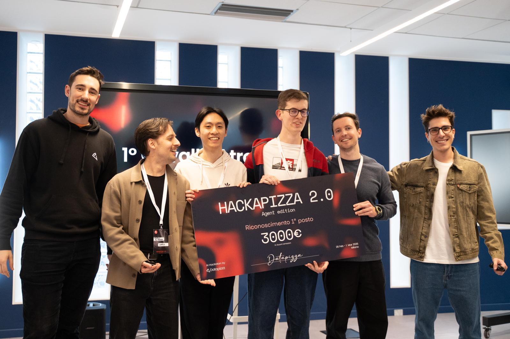
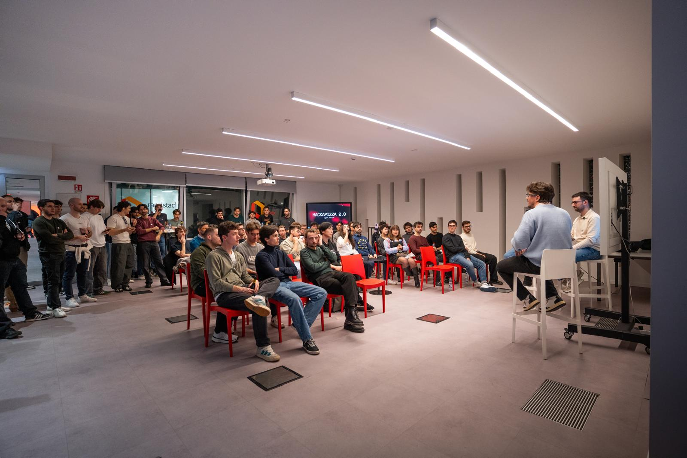
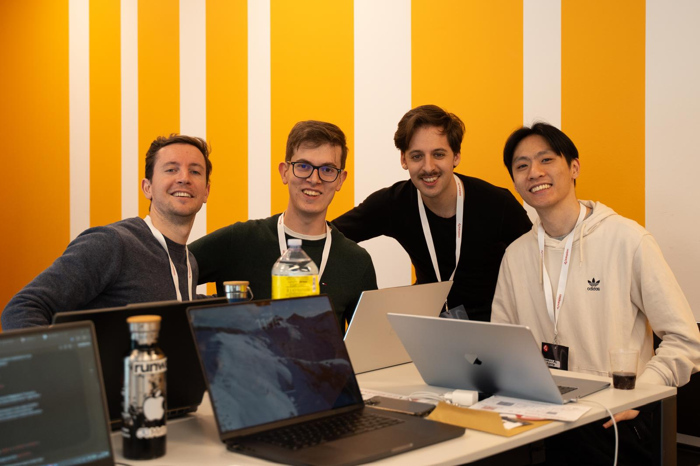
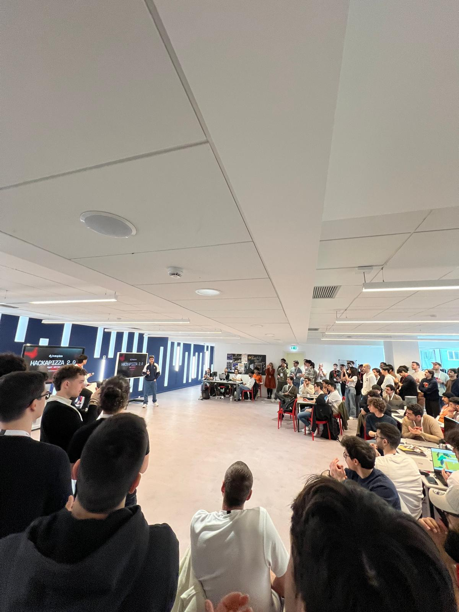
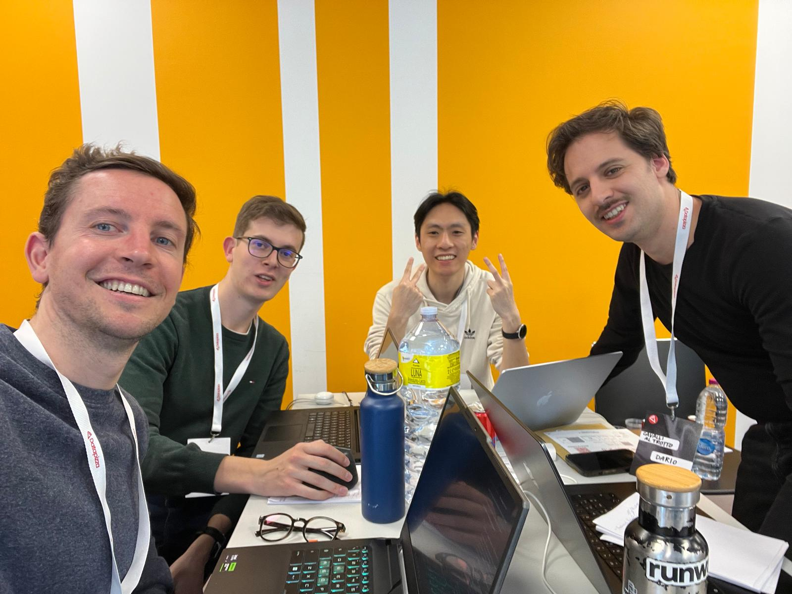
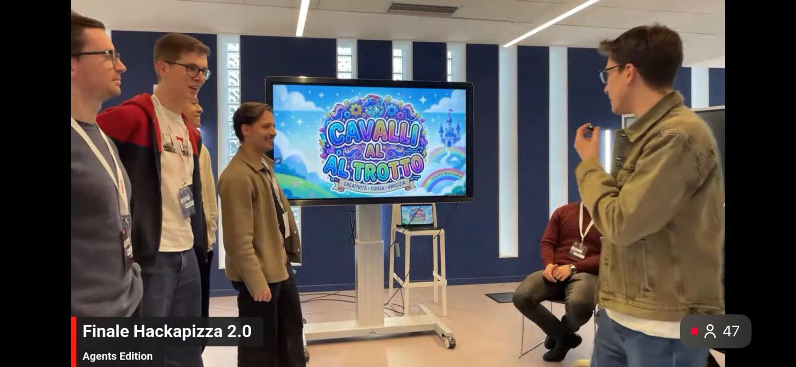
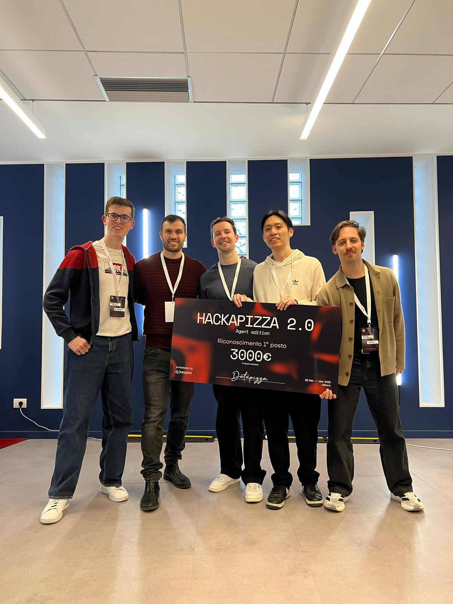
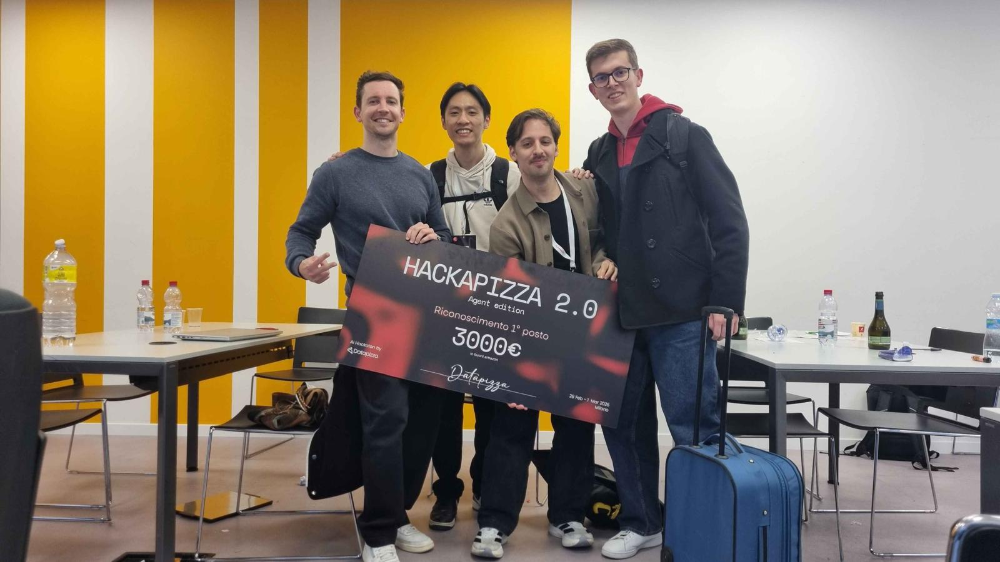
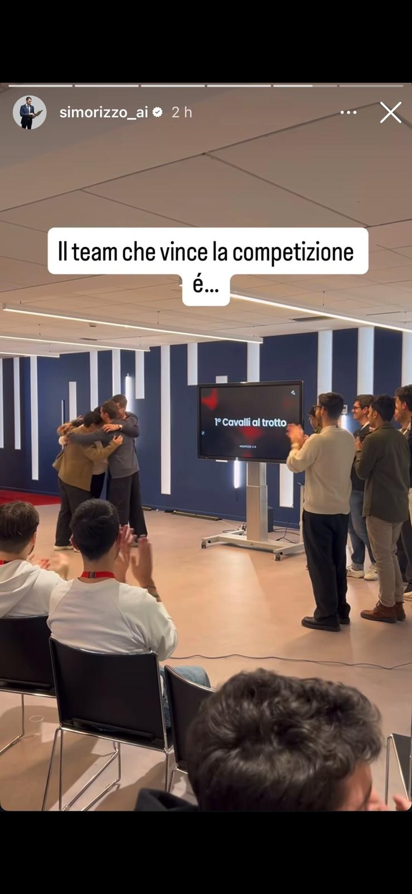

what a weekend!! on february 28th and march 1st, our team **"Cavalli al trotto 🐎"** won 🏆 [Hackapizza 2.0: Agent Edition](https://hackathon.datapizza.com/), the hackathon organized by [Datapizza](https://datapizza.tech/) in Milan — one of the most intense and stimulating competitions i've ever taken part in.

24 hours non-stop designing, testing and stress-testing advanced agentic systems, competing against 120 selected participants from all over Italy.

the team was composed of [Giacomo Pacini](https://github.com/Ruggero1912), [Dario Cioni](https://github.com/ciodar), [Alessio Chen](https://github.com/AlessioChen) and me.

<div align="center">
  
</div>

# 🍕 The Challenge

the hackathon track was "galactic" themed, building on the first edition: participants had to build a **fully autonomous virtual restaurant** — no human intervention allowed.

the AI agents had to independently:
- purchase ingredients through a **blind auction**
- define the **menu and prices** dynamically
- **exchange ingredients** between competing teams
- **serve incoming clients**, managing queues and priorities
- read a blog with **"news" and market trends**
- **analyze competitors and the market** to maximize revenue

the competition used the **[datapizza-ai](https://docs.datapizza.ai/)** open-source agentic framework, with API inference provided by [Regolo.ai](https://regolo.ai/), a european LLM inference provider.

---

# 🤖 System Architecture

we built a **real-time multi-agent system** that simulates running a restaurant in an alien universe. five specialized AI agents compete against other restaurants to maximize profit through intelligent decision-making.

## Agents

| agent | phase | purpose |
|-------|-------|---------|
| **menu agent** | speaking / waiting | decide dishes and pricing |
| **bid agent** | closed_bid | determine ingredient bids |
| **allergy agent** | serving | extract allergies & intolerances from order text |
| **service agent** | serving | match client order to a safe dish |
| **memory agent** | stopped | generate turn summaries and lessons learned |

## Turn Structure

each game turn progresses through five sequential phases:

| phase | purpose | key actions |
|-------|---------|------------|
| **speaking** | planning & diplomacy | open restaurant, decide menu, negotiate |
| **closed bid** | ingredient procurement | submit blind bids in auction |
| **waiting** | strategic adjustment | adjust menu based on actual inventory |
| **serving** | customer service | cook and deliver dishes to clients |
| **stopped** | end-of-turn analysis | generate summary, clear transient state |

**critical rule:** ingredients expire at the end of each turn — unsold inventory is lost. this pushed us to design a bidding agent that estimated demand carefully rather than over-buying.

---

# ⚙️ How It Works

the system is entirely **event-driven**: an SSE loop is the heartbeat, and every game event triggers a handler that updates in-memory state and schedules background work without blocking the loop.

```
game server (SSE)
      │
      ▼
┌─────────────┐   game_phase_changed    ┌──────────────────────────────────────────┐
│  SSE loop   │ ──────────────────────► │         orchestrator (background task)   │
│  (main.py)  │                         │                                          │
│             │   client_spawned        │  speaking  ──► menu_agent  ──► save_menu │
│             │ ──────────────────────► │  closed_bid ──► bid_agent  ──► closed_bid│
│             │   preparation_complete  │  waiting   ──► menu_agent  ──► save_menu │
│             │ ──────────────────────► │  serving   ──► per-client flow           │
└─────────────┘                         │  stopped   ──► memory_agent ──► db summary│
                                        └──────────────────────────────────────────┘
```

## Per-Client Serving Flow

when a `client_spawned` event arrives, the orchestrator processes the client in a dedicated async task:

```
client_spawned { clientName, orderText }
        │
        ▼
1. allergy_agent ──► detect allergies from free-form order text
        │
        ▼
2. pre-filter menu ──► remove any dish containing a forbidden ingredient
        │
        ▼
3. service_agent ──► pick the best safe dish from the filtered menu
        │              (defense-in-depth re-check if LLM picked unsafe dish)
        ▼
4. prepare_dish (MCP) ──► wait for preparation_complete SSE event
        │
        ▼
5. serve_dish (MCP) ──► meal delivered, logged to DB
```

if any step fails, the orchestrator falls back to a deterministic dish picker that also enforces allergy constraints.

---

# 🧩 Key Architectural Decisions

## Long-Term Memory
one of the main challenges of the hackathon was managing **long-term memory** across game turns. the memory agent generates structured turn summaries — lessons learned, bidding outcomes, competitor behavior — that are persisted to MySQL and fed back into the next turn's planning.

## State Persistence
every decision and tool call is persisted to MySQL in real time:

```
allergy_agent decision  ─┐
menu_agent decision     ─┤──► decisions table
bid_agent decision      ─┤
service_agent decision  ─┘

prepare_dish / serve_dish ─┐
save_menu / closed_bid     ─┘──► mcp_calls table (with latency_ms)

game_phase_changed ─┐
client_spawned      ─┘──► sse_events table
```

## Deterministic Fallbacks
every AI agent has a deterministic fallback path — this was critical to avoid losing turns when LLM calls timed out under high concurrency during the competition.

---

# 📁 Project Structure

```plaintext
hackapizza2.0/
├── main.py                  # entry point: SSE listener & event dispatcher
├── hackapizza/
│   ├── agents.py            # AI agents (menu, bid, service, memory, allergy)
│   ├── context.py           # AppContext & GameState singleton
│   ├── db.py                # MySQL persistence layer
│   ├── http_client.py       # game API HTTP client
│   ├── mcp_actions.py       # MCP tool invocation client
│   └── orchestrator.py      # phase coordinator & agent orchestrator
├── hackapizza-dashboard/    # git submodule: monitoring dashboard
├── recipes-analysis/        # 900+ recipes dataset & analysis
└── docker-compose.yml       # MySQL + Redis + dashboard services
```

---

# 🛠️ Tech Stack

- **language:** Python 3.12+ (async/await)
- **AI framework:** [datapizza-ai](https://docs.datapizza.ai/)
- **LLM provider:** [Regolo.ai](https://regolo.ai/) (OpenAI-compatible, european)
- **networking:** aiohttp (SSE + HTTP), JSON-RPC
- **database:** MySQL 8.4, Redis 7 (Docker)
- **dependency management:** uv

---

# 🎬 Conclusion

this was one of the most technically demanding competitions i've experienced. the combination of multi-agent orchestration, real-time event-driven architecture, complex game theory decisions and very tight time constraints made every hour count.

beyond the technical side, it was great to meet and exchange ideas with other AI enthusiasts and professionals from all over Italy — discussing architectural patterns, agent design choices and future directions for AI systems.

a special thanks to the entire **Datapizza** team for organizing such an impeccable event, and to the jury: Simone Rizzo, Enrico Mensa, Giuseppe Gullo, and Giacomo Ciarlini.

## 🔗 GitHub Repository
visit the project repository [here](https://github.com/AlessioChen/HACKAPIZZA-2.0) for accessing the full codebase (if you enjoyed this content, please consider leaving a star ⭐).

## 📸 Photos

<div style="display: flex; flex-wrap: wrap; gap: 10px;">
  
  
  
  
  
  
  
  
  
  
</div>
