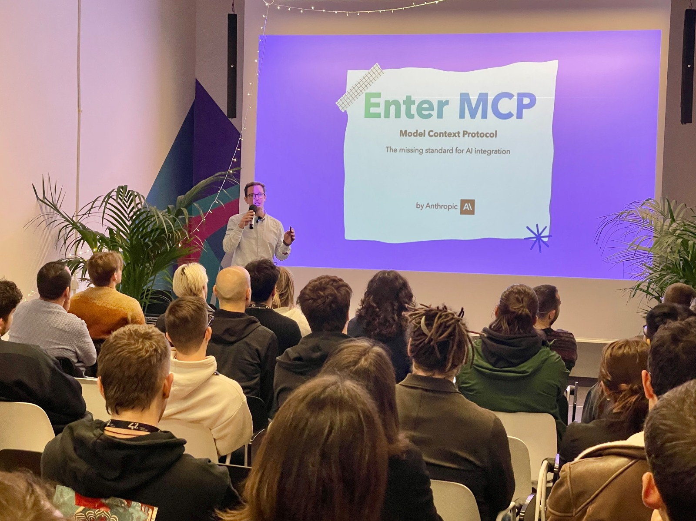
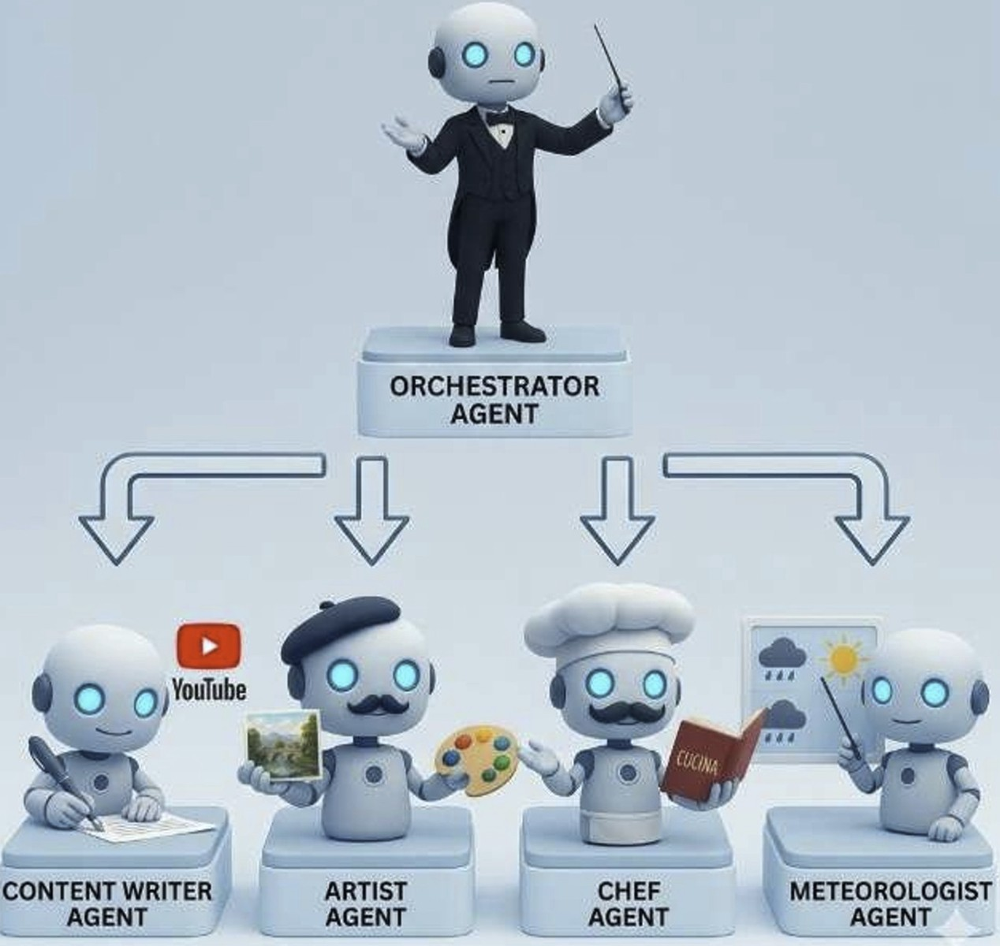
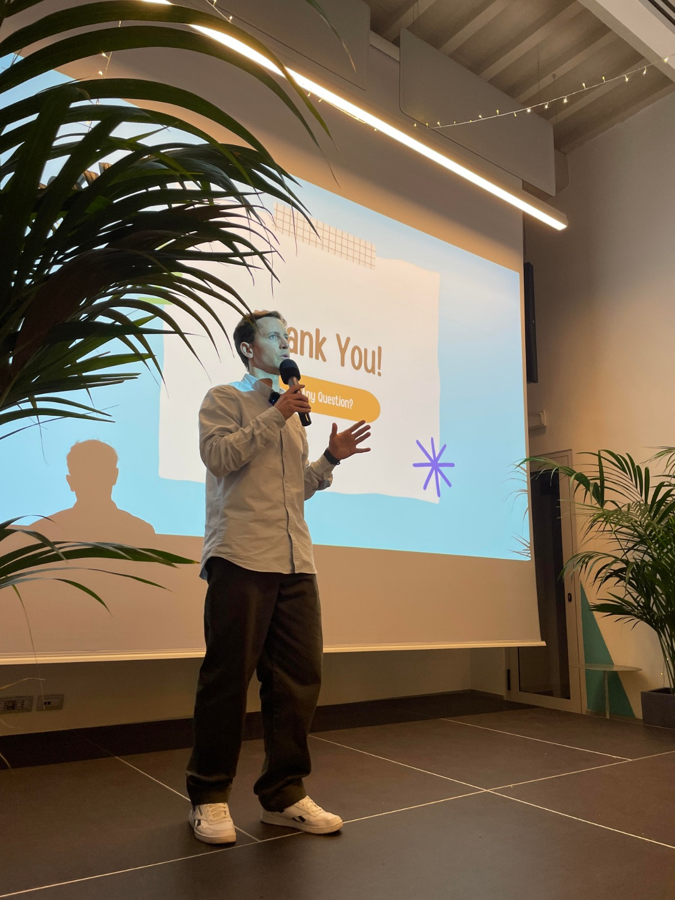
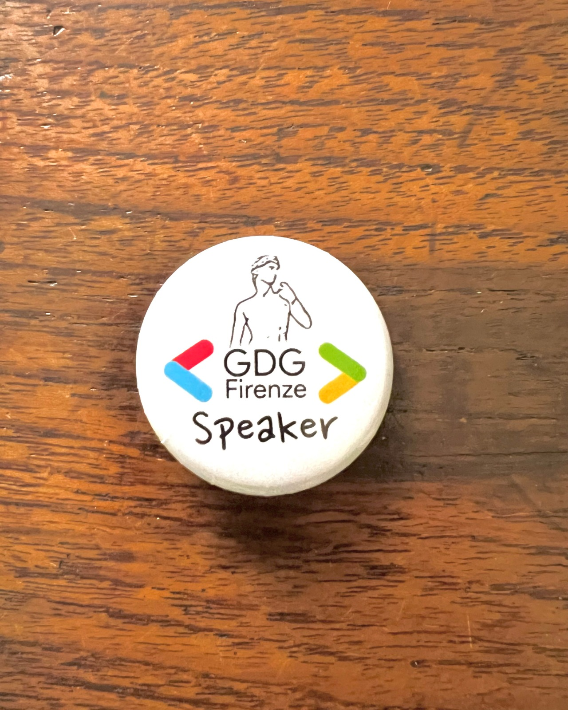
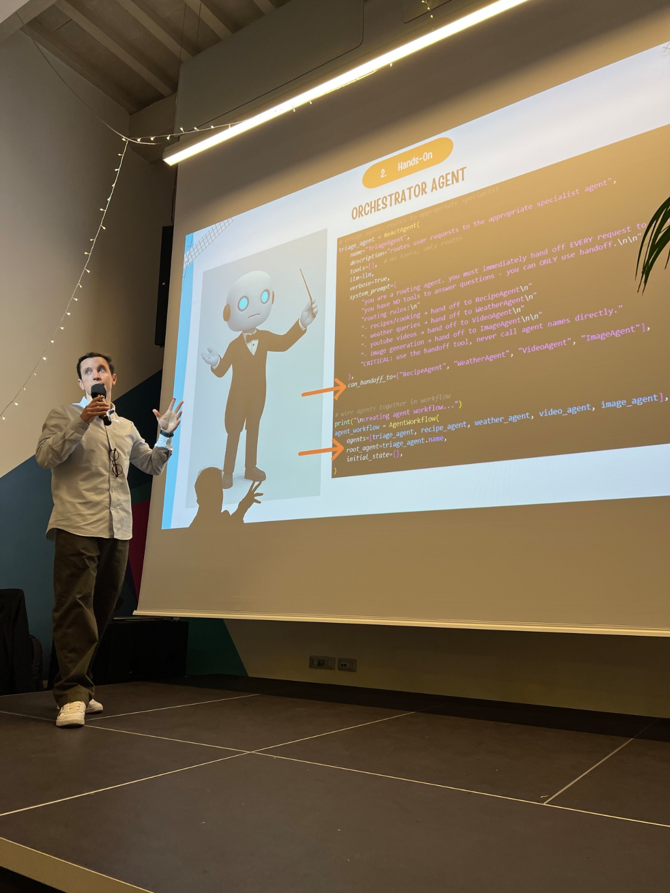
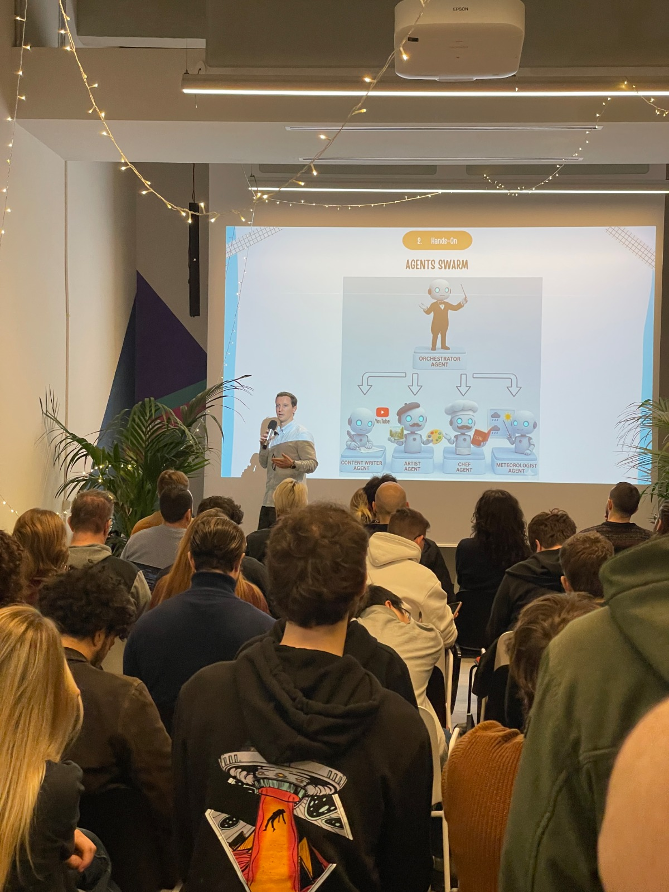
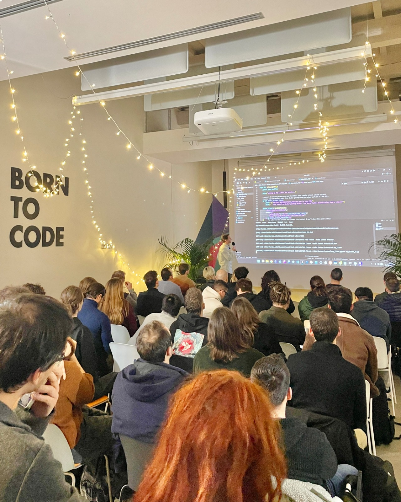
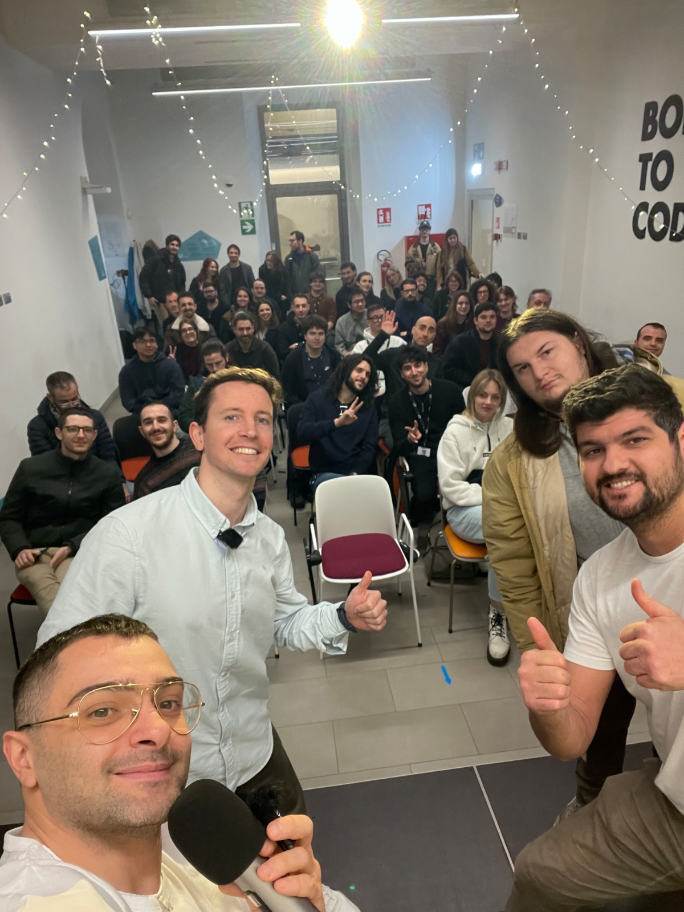

what an incredible evening!! on march 5th i had the pleasure of speaking at the [Google Developer Group Firenze](https://gdg.community.dev/gdg-firenze/) meetup, talking about the **Model Context Protocol (MCP)** in front of a packed room at [42 Firenze](https://42firenze.it/).

the energy in the room, the questions, the conversations that kept going during the networking session after — it was a fantastic reminder of how vibrant and passionate this community is.
<div align="center">
  
</div>
---

# 🎯 The Talk

**"Model Context Protocol: l'importanza della standardizzazione nell'era degli agenti AI"**

the core theme of the session was one i feel strongly about: **standardization matters**. in an AI ecosystem as fragmented as today's, without shared protocols the risk is getting trapped in endless custom integrations — closed ecosystems that slow down innovation instead of accelerating it.

this is exactly why MCP is establishing itself as the de facto standard: a unified protocol that allows AI models and agents to access tools and data in a uniform, secure and interoperable way.

# 🗂️ What We Covered

the session was structured to move progressively from theory to practice:

## The Current AI Ecosystem
a brief overview of how we got here — the fragmentation problem and the path that led to MCP: what it is, why it was created by Anthropic, and how its architecture works.

## Interacting With MCP Servers
starting from the simplest way to interact with MCP servers: using them directly inside chatbots and IDEs. understanding the basics before diving deeper.

## Building Custom MCP Servers
from consuming servers to building them — how to define and create custom MCP servers designed for specific needs. different deployment strategies were explored:
- **local execution** for development and testing
- **cloud deployment** for production use
- **third-party MCP servers** from the growing ecosystem

## Multi-Agent Orchestration
the final and most advanced part: building a **multi-agent system** that combines multiple MCP-based tools, showing how agents can collaborate intelligently within complex workflows.

the demo first showed a **hybrid agent** connecting to 4 MCP sources simultaneously — a local recipe server, a remote weather server, a Docker MCP Gateway for YouTube transcription, and a Hugging Face Space for image generation. this immediately exposed a real problem: **tool overload**. too many tools confuse the agent, degrade performance, and make routing unreliable.

the solution presented was a **triage-based swarm architecture** ([source](https://github.com/enricollen/tech-talks/tree/main/2026/GDG%20Firenze%20-%20Model%20Context%20Protocol)), where a `TriageAgent` acts as the orchestrator and hands off each request to the right specialized subagent:

```
TriageAgent (orchestrator)
    ├── RecipeAgent    → local MCP server (italian recipes)
    ├── WeatherAgent   → FastMCP cloud server (weather)
    ├── VideoAgent     → Docker MCP Gateway (YouTube transcription)
    └── ImageAgent     → Hugging Face Space as MCP tool (image generation)
```

each subagent only has access to its own tools — clean separation of concerns, better performance, and easy to extend. the whole system was built with **LlamaIndex** for agent orchestration, **FastMCP** for the custom server, and a **Gradio** UI for the live demo.

<div align="center">
  
  <p><em>the multi-agent swarm architecture presented during the demo — full code available on <a href="https://github.com/enricollen/tech-talks/tree/main/2026/GDG%20Firenze%20-%20Model%20Context%20Protocol">GitHub</a></em></p>
</div>

---

# 💡 Key Takeaways

- **standardization is not optional** — without it, AI ecosystems fragment into silos
- **MCP is the universal adapter** for connecting LLMs to tools, databases, APIs and services
- once you understand the protocol, building and deploying custom servers is surprisingly straightforward
- multi-agent systems built on MCP can tackle complex, real-world workflows with clean separation of concerns
- the community interest was huge — from developers already experimenting with MCP to people discovering it for the first time

---

# 🙏 Thanks

a huge thanks to the entire **GDG Firenze** team for the impeccable organization, and to **42 Firenze** for hosting us in their incredible space.

the questions and discussions that emerged during the session — and continued over pizza — confirmed just how alive and curious this community is. can't wait for the next one!

---

# 🔗 Resources

all the material from the talk — slides, demo code, and setup instructions — is available on my GitHub:

👉 [enricollen/tech-talks — GDG Firenze: Model Context Protocol](https://github.com/enricollen/tech-talks/tree/main/2026/GDG%20Firenze%20-%20Model%20Context%20Protocol)

feel free to use the slides, code, or any other material for your own projects or presentations — just please cite the source 🙏

---

## 📸 Photos

<div style="display: flex; flex-wrap: wrap; gap: 10px;">
  
  
  
  
  
  
  
</div>
