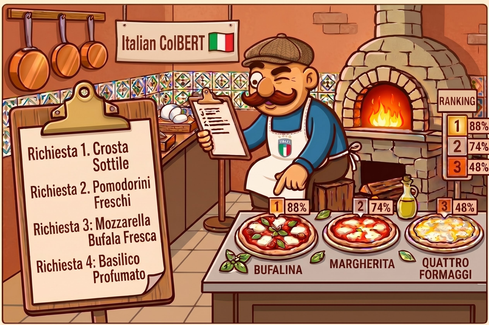
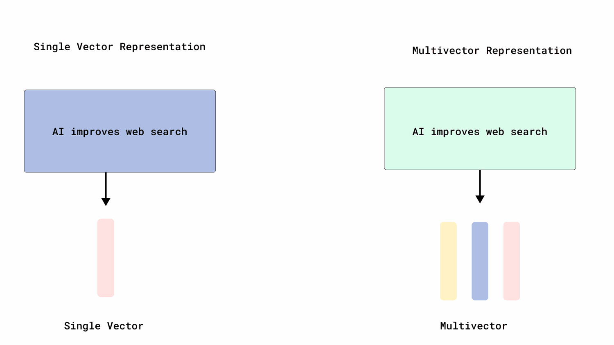
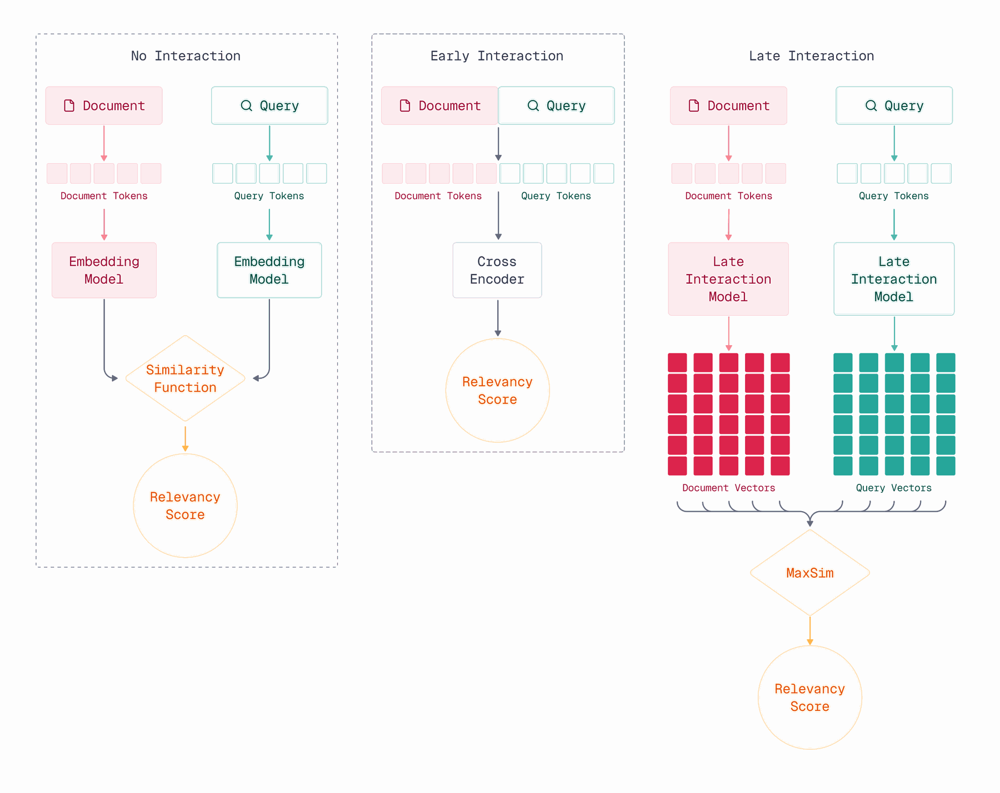
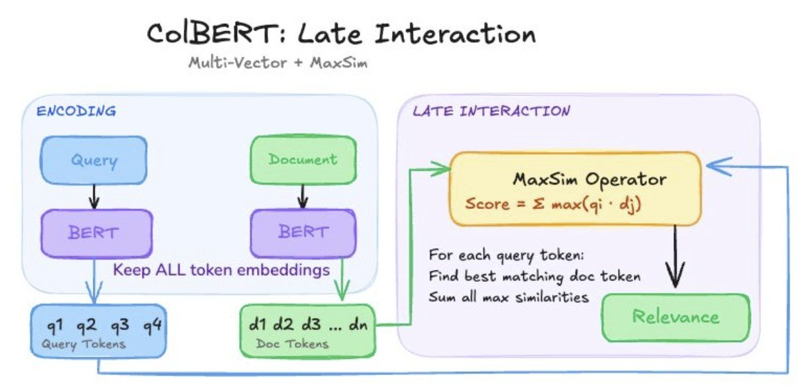

<div align="center">
  
</div>

to my knowledge, there was no **monolingual Italian ColBERT** out there — plenty of multilingual late-interaction models include Italian among dozens of languages, and plenty of strong Italian dense embedders exist, but nothing combined the two: an Italian-*specialized* model that keeps token-level matching. that gap is what made me want to try building one myself.

the result is **ItColBERT**, trained end to end on a single RTX 3090 at home, with every design decision, failed experiment and dead end documented along the way rather than hidden.

## 🧩 What is Late Interaction?

most retrieval embedding models compress a whole passage into **one vector**. ColBERT-style **late interaction** models keep **one small vector per token** instead, and score a document by matching each query token against its best document token (**MaxSim**) rather than comparing two averaged blobs.

that keeps fine-grained detail — exact names, numbers, phrasing — that gets blurred away by single-vector compression, at the cost of a larger index. it's the retrieval approach behind [ColBERT / ColBERTv2](https://github.com/stanford-futuredata/ColBERT) from Stanford, and the one [PyLate](https://github.com/lightonai/pylate) (the library this project is built on) makes practical to train and serve.

<details markdown="1">
<summary><strong>🔎 curious how late interaction actually works, step by step? (click to expand)</strong></summary>

<br>

**Single vector vs. multi-vector representations**

a "normal" dense retriever squeezes an entire passage — however long — into **one fixed-size vector**, a single point that's supposed to summarize its whole meaning. a multi-vector representation instead keeps **one vector per token**: the sentence "AI improves web search" doesn't become one blob, it becomes four small vectors, one per word, each preserving that word's own meaning in context.

<div align="center">
  
  <br><em>source: <a href="https://qdrant.tech/documentation/tutorials-search-engineering/using-multivector-representations/">Qdrant docs — multivector representations</a></em>
</div>

<br>

**No interaction vs. early interaction vs. late interaction**

the three retrieval families differ in **when** the query and the document actually "meet":

- **no interaction** (plain dense retrieval / bi-encoders): query and document are each squeezed into a single vector, completely independently, and only compared at the very end via a cheap similarity function (cosine/dot product). every document can be encoded **offline, once**, and at query time only the query needs encoding — extremely fast, but the model never sees query and document together, so a lot of nuance gets averaged away.
- **early interaction** (cross-encoders): query and document text are concatenated and pushed through the transformer **together**, so every document token can attend to every query token through several self-attention layers. this is the most accurate scoring approach — but nothing about the document can be precomputed, so the full model has to rerun **per document, per query**. too slow to search a whole corpus with; used only to rerank a short candidate list.
- **late interaction** (ColBERT-style): documents are still encoded independently and fully precomputable offline — but as **many** token vectors, not one. at query time only the query needs fresh encoding; the actual query↔document comparison happens at scoring time via MaxSim. this recovers much of a cross-encoder's token-level precision while keeping the expensive part (encoding documents) something done once, offline — not per query.

<div align="center">
  
  <br><em>source: <a href="https://qdrant.tech/course/multi-vector-search/module-1/late-interaction-basics/">Qdrant course — late interaction basics</a></em>
</div>

<br>

**The MaxSim operator, in words**

for every single query token, MaxSim looks across **all** of a document's token vectors and finds the one that matches best — then adds up these best-matches, one per query token, into the document's final score. so a document doesn't need to match the query's *overall* meaning; for every individual query token, it just needs *somewhere* in the text a close match to that specific word. that's exactly what lets late interaction preserve exact names, numbers and phrasing — the things a single averaged vector blurs away.

<div align="center">
  
  <br><em>source: <a href="https://www.linkedin.com/posts/shubhendu-sharma_rag-retrievalaugmentedgeneration-colbert-activity-7440947799581499392-pOzw/">Shubhendu Sharma, LinkedIn</a></em>
</div>

<br>

**A worked example**

illustrative numbers below, not real model output (the "Try it" section further down has that) — just enough to make the difference concrete, with every number actually computed rather than made up on the spot. take one query and two candidate documents:

- **query:** *"capitale Italia"* → tokens: `capitale`, `Italia`
- **doc A:** *"Roma è la capitale d'Italia"* (Rome is the capital of Italy) → tokens (stopwords dropped for readability): `Roma`, `capitale`, `d'`, `Italia`
- **doc B:** *"Milano è la capitale economica del Paese"* (Milan is the economic capital of the country) → tokens: `Milano`, `capitale`, `economica`, `Paese`

doc A is obviously the right answer to a human. to make the arithmetic followable, every token above gets a tiny **4-dimensional toy vector** along four made-up axes — *"capital/seat-of-government"*, *"Italy the country"*, *"Milan / economic"*, and *"meaningless filler word"*. real ColBERT vectors have 128 learned dimensions; these four are invented purely so the numbers below can be checked by hand:

| Token | capital | italy | milan/economic | filler |
|---|---|---|---|---|
| query: `capitale` | 0.95 | 0.10 | 0.05 | 0.00 |
| query: `Italia` | 0.05 | 0.95 | 0.05 | 0.00 |
| doc A: `Roma` | 0.55 | 0.60 | 0.05 | 0.10 |
| doc A: `capitale` | 0.96 | 0.07 | 0.04 | 0.00 |
| doc A: `d'` | 0.02 | 0.02 | 0.01 | 0.90 |
| doc A: `Italia` | 0.04 | 0.94 | 0.04 | 0.02 |
| doc B: `Milano` | 0.25 | 0.05 | 0.80 | 0.05 |
| doc B: `capitale` | 0.88 | 0.05 | 0.30 | 0.00 |
| doc B: `economica` | 0.15 | 0.05 | 0.85 | 0.02 |
| doc B: `Paese` | 0.30 | 0.35 | 0.20 | 0.05 |

every similarity number below is the **cosine similarity** between two of these vectors — how aligned their directions are, from -1 (opposite) to 1 (identical). worked by hand for one pair, query `capitale` vs. doc A's `capitale`: dot product = (0.95×0.96)+(0.10×0.07)+(0.05×0.04)+(0.00×0.00) = 0.921; vector lengths ≈ 0.957 and ≈ 0.963; cosine = 0.921 ÷ (0.957×0.963) ≈ **1.00** — near-perfect alignment, as expected for the literal same word.

**no interaction (single vector / bi-encoder).**

- **input:** the query text alone, and each document text alone — encoded completely separately, never together, never even at the same time.
- **what happens:** all of a text's token vectors above get averaged ("pooled") into one single vector: q̄ = mean(`capitale`, `Italia`) = [0.50, 0.53, 0.05, 0.00]; docA-pooled = mean(4 tokens) = [0.39, 0.41, 0.04, 0.26]; docB-pooled = mean(4 tokens) = [0.40, 0.13, 0.54, 0.03].
- **output:** one cosine similarity score per document — a single number, query-vector vs. that document's single vector, nothing else:

| Document | Similarity to query |
|---|---|
| Doc A | 0.91 |
| Doc B | 0.59 |

doc A still ranks higher here — but only because in this toy example the distinguishing word (`Italia`) is 1 of just 4 tokens per document. average that same word into a real document of a few hundred words and its share of the pooled vector shrinks toward nothing; the pooled vector ends up dominated by whatever's most common in the text, not by what actually answers the query. that dilution — not "always gets the ranking wrong" — is the real weakness late interaction is built to avoid.

**early interaction (cross-encoder).**

- **input:** query **and** document together, concatenated into one sequence and pushed through the transformer jointly, e.g. `[CLS] capitale Italia [SEP] Roma è la capitale d'Italia [SEP]`. every document token can attend to every query token (and vice versa) through several self-attention layers before any score exists.
- **output:** a single number — a raw relevance **logit**, not a vector, nothing decomposable per word — usually passed through a sigmoid to turn it into a 0–1 relevance probability:

| Document | Raw logit | σ(logit) → relevance probability |
|---|---|---|
| Doc A | 4.2 | 0.985 |
| Doc B | -0.8 | 0.310 |

very decisive — joint attention lets the model directly notice that doc A follows "capitale" with "d'Italia" while doc B doesn't. but producing this single number required a full transformer forward pass **per document, at query time** — nothing about a document can be computed before the query is known, since the model only sees the two together. that's why cross-encoders only rerank a short list of candidates (tens of documents) instead of searching an entire corpus directly.

**late interaction (MaxSim).**

- **input:** query and document encoded **completely separately** — exactly like "no interaction" — but instead of pooling down to one vector, every token keeps its own. document token vectors can be computed and stored **before any query exists**; at search time only the query needs fresh encoding.
- **output:** not one number from a single comparison, but a score built from many — every query token is compared against every document token, and the best match per query token is kept and summed:

*doc A* — tokens: `Roma`, `capitale`, `d'`, `Italia`

| query token | Roma | capitale | d' | Italia | best match |
|---|---|---|---|---|---|
| `capitale` | 0.74 | **1.00** | 0.02 | 0.15 | capitale → 1.00 |
| `Italia` | 0.77 | 0.13 | 0.02 | **1.00** | Italia → 1.00 |

`MaxSim(doc A) = 1.00 + 1.00 = 2.00`

*doc B* — tokens: `Milano`, `capitale`, `economica`, `Paese`

| query token | Milano | capitale | economica | Paese | best match |
|---|---|---|---|---|---|
| `capitale` | 0.35 | **0.96** | 0.23 | 0.68 | capitale → 0.96 |
| `Italia` | 0.12 | 0.12 | 0.12 | **0.74** | Paese → 0.74 |

`MaxSim(doc B) = 0.96 + 0.74 = 1.70`

late interaction ranks **doc A (2.00) clearly above doc B (1.70)** — a ~18% gap. notice both documents match the query token `capitale` almost equally well — both literally contain that word — but `Italia` only finds a near-perfect match in doc A; in doc B the best it can do is `Paese` ("country"), related but clearly weaker (0.74, not 1.00). a cross-encoder catches this same distinction too, just not without rerunning the full model per document at query time. the single pooled vector *also* got the ranking right in this toy example (0.91 vs. 0.59) — but only because the one distinguishing word is still 1 of just 4 tokens, so pooling can't fully bury it yet. MaxSim's advantage isn't that it wins this particular tiny example; it's that its per-token maximum, `Italia` → `Italia` at 1.00, is completely unaffected by document length — add another 500 unrelated words to doc A and MaxSim still finds that same 1.00 match, while the pooled vector keeps diluting further with every token added.

</details>

## 🎯 Why an Italian-Specialized Model?

before this project, the Italian options were:

- multilingual late-interaction models that *include* Italian among many languages ([`jina-colbert-v2`](https://huggingface.co/jinaai/jina-colbert-v2), [`mLateOn`](https://huggingface.co/lightonai/mLateOn), [`ColBERT-XM`](https://huggingface.co/antoinelouis/colbertxm), [`SauerkrautLM-Multi-ModernColBERT`](https://huggingface.co/VAGOsolutions/SauerkrautLM-Multi-ModernColBERT))
- strong Italian dense embedders that drop late interaction entirely

not "the first Italian ColBERT" — the models above already cover Italian — but the first one **specialized** on it.

## 🛠️ How It Was Built

**backbone:** [`nickprock/Italian-ModernBERT-base-embed-mmarco-mnrl`](https://huggingface.co/nickprock/Italian-ModernBERT-base-embed-mmarco-mnrl) → PyLate `ColBERT` (token vectors, dim 128, MaxSim). starting from a checkpoint that already retrieves, rather than a raw language model, follows the [ColBERT-Zero](https://huggingface.co/blog/lightonai/colbert-zero) efficiency result: supervised contrastive + distillation from a retrieval-capable init reaches ~99% of full multi-vector pretraining at roughly **10× lower cost**.

| stage | what it does |
|---|---|
| **phase 1 — contrastive** | supervised contrastive training on mMARCO-it triples, reranker-mined hard negatives, Italian Wikipedia retrieval pairs, MIRACL-ita and SQuAD-ita — ~2.4M triplets |
| **phase 2 — distillation** | KL distillation from a single cross-encoder teacher (`mxbai-rerank-large-v2`, via LightOn's dataset), sample budget spread proportionally across all 8 dataset splits |
| **checkpoint selection** | on retrieval metrics (nDCG@10 / MRR@10), never on hold-out KD loss alone |

## 🗺️ The Journey (Including What Didn't Work)

three rounds of work, and two of them were rejected after fair testing — which is arguably the more useful part to write down:

1. **round 1 — broaden the data, then distil.** the starting checkpoint only knew machine-translated mMARCO. added more varied Italian sources, then a distillation stage from a cross-encoder teacher. this became the model that shipped — strongest Italian-specialized late-interaction model tested, weakest on long documents.
2. **found the long-document weakness was mostly mechanical.** the hardest benchmark's documents run a few thousand words; they were being truncated at 512 tokens, discarding ~80% of the average document. chunking documents at query time — **no retraining at all** — recovered most of the gap (+0.06 nDCG@10, the largest single gain in the whole project).
3. **round 2 — mined harder negatives** from the model's own prediction mistakes. no real improvement, and a measurable regression in generalization. rejected.
4. **round 3 — trained the model to natively read twice as much text per document** (1024 vs 512 tokens), instead of relying on query-time chunking. ran a controlled A/B on identical data. statistically indistinguishable from just chunking a normally-trained model, once compared fairly on held-out queries. rejected.
5. **what shipped:** since neither training round beat "train normally, then chunk long documents at query time," that's exactly what's in the released model.

the full numbers behind every one of these steps — including the significance testing, not just the headline deltas — are in [`TODO.md`](https://github.com/enricollen/it-colbert/blob/main/TODO.md) in the repo.

## 📊 Results

real numbers, paired-bootstrap significance tested. **†** = not statistically distinguishable from ItColBERT (p > .05) — read those as ties regardless of which number is higher.

| Model | MLDR-it (nDCG@10) | mMARCO-it (MRR@10) | MIRACL-ita (nDCG@10) | SQuAD-ita (nDCG@10) |
|---|---|---|---|---|
| **ItColBERT** | **0.4008** (0.4610 chunked) | **0.7196** | **0.7194** | **0.9026** |
| mLateOn | 0.4623 | 0.8207 | 0.7880 | 0.9480 |
| jina-colbert-v2 | 0.3858 † | 0.8389 | 0.7755 | 0.8849 |
| bge-m3 (dense) | 0.4531 | 0.7812 | 0.7566 | 0.8247 |
| multilingual-e5-large (dense) | 0.4310 † | 0.8239 | 0.7653 | 0.8513 |
| SauerkrautLM-Multi-ModernColBERT | 0.3122 | 0.5342 | 0.5996 | 0.8338 |
| ColBERT-XM | 0.2734 | 0.6654 | 0.6260 | 0.8558 |
| BM25 | 0.4850 (vs. 0.4610 chunked: †) | 0.5715 | 0.5516 | 0.8262 |

the strongest **Italian-specialized** late-interaction model tested here, beating every general-purpose late-interaction alternative except one (mLateOn, the strongest multilingual late-interaction model found). behind large multilingual dense embedders on most benchmarks — matching those was never the goal, they're a different model class.

## 🪶 Small but Capable

one point worth calling out on its own: **ItColBERT is the smallest model in the whole comparison** — and it isn't close.

| Model | Parameters | MLDR-it (nDCG@10) |
|---|---|---|
| **ItColBERT** | **~135M** | **0.4008** (0.4610 chunked) |
| SauerkrautLM-Multi-ModernColBERT | 149M | 0.3122 |
| ColBERT-XM | 277M | 0.2734 |
| mLateOn | 307M | 0.4623 |
| multilingual-e5-large (dense) | 560M | 0.4310 † |
| bge-m3 (dense) | 568M | 0.4531 |
| jina-colbert-v2 | ~0.6B | 0.3858 † |

built on ModernBERT-**base** rather than one of the ~560M-parameter multilingual giants, ItColBERT still comes out ahead of `SauerkrautLM-Multi-ModernColBERT` (roughly the same size class), `ColBERT-XM` (2× the parameters), and statistically ties `jina-colbert-v2` (~4.4× the parameters) on the primary out-of-domain benchmark. mLateOn is the one model that beats it outright while also being smaller than the dense giants — worth being upfront about rather than glossing over.

being 4× smaller than the multilingual giants and still landing in the same neighborhood matters in practice: smaller index footprint, cheaper inference, and it's realistic to fine-tune or run fully offline on a single consumer GPU — which is exactly how the whole thing was built and evaluated in the first place.

## 🚀 Try It

```bash
pip install -U pylate
```

```python
from pylate import rank, models

model = models.ColBERT(model_name_or_path="enricollen/ItColBERT")

queries = ["Qual è la capitale d'Italia?"]
documents = [[
    "Roma è la capitale d'Italia.",
    "Milano è la capitale economica del Paese.",
]]
documents_ids = [[1, 2]]

queries_embeddings = model.encode(queries, is_query=True)
documents_embeddings = model.encode(documents, is_query=False)

reranked = rank.rerank(
    documents_ids=documents_ids,
    queries_embeddings=queries_embeddings,
    documents_embeddings=documents_embeddings,
)
print(reranked)
# [[{'id': 1, 'score': 31.682}, {'id': 2, 'score': 31.552}]]
# one list per query, sorted highest score first — "Roma" wins, as expected.
```

model card, indexing recipe for full corpora, and the long-document chunking trick are all on the [Hugging Face page](https://huggingface.co/enricollen/ItColBERT).

## 💻 Hardware

everything — every training run, every benchmark, all significance testing — was done on **one consumer machine**, not a cluster:

- **CPU**: Intel Core i7-14700K
- **GPU**: NVIDIA RTX 3090 (24GB)
- **RAM**: 32GB (27GB usable under WSL2)

no multi-GPU, no cloud compute. that ceiling shaped quite a few decisions along the way — mini-batch sizes, chunking's ~26GB host-RAM cost, a couple of OOM kills documented in the repo.

## ⚠️ Limitations & What's Next

- MIRACL-ita and SQuAD-ita are **community machine translations**, not official benchmark resources — labelled as such everywhere they're used
- behind large multilingual dense embedders on most axes; the goal here was an Italian-*specialized* late-interaction model, not beating general-purpose giants
- next candidates on the list: RRF fusion with BM25 (looks like the cheapest real gain left), a dim-64 variant for smaller indexes, and pinning dataset revisions for full reproducibility

## 🔗 Links

- 🐙 GitHub repository: **[github.com/enricollen/it-colbert](https://github.com/enricollen/it-colbert)** — training code, benchmark suite, and the full development history (if you find it useful, a star ⭐ is always appreciated)
- 🤗 Model on Hugging Face: **[huggingface.co/enricollen/ItColBERT](https://huggingface.co/enricollen/ItColBERT)** — ready-to-use weights, model card, and usage examples

## 🎬 Conclusion

this was as much a project about **measurement discipline** as it was about training a model. two separate training-based attempts (harder negatives, training at longer document length) both failed to beat a training-free trick (chunking) that only surfaced because I bothered to check where the truncation was actually happening. that's the actual lesson from this project — not every improvement needs more GPU hours, sometimes it needs a better look at the data first.

if you work with Italian text search or RAG and want token-level retrieval without going multilingual, give it a try and let me know how it performs on your data.
