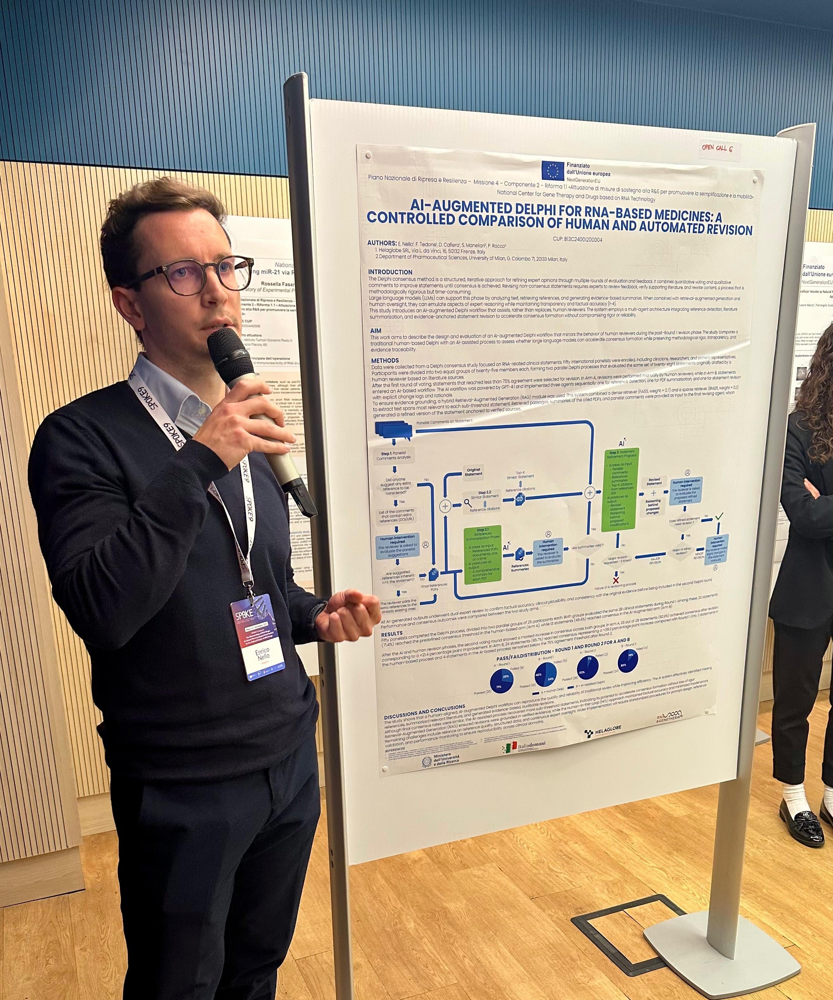

---
# the default layout is 'page'
icon: fas fa-info-circle
order: 4
---

<!-- > Add Markdown syntax content to file `_tabs/about.md`{: .filepath } and it will show up on this page.
 {: .prompt-tip }-->

Hello there! I'm Enrico Nello, a Computer Engineer with MSc degree in Artificial Intelligence & Data Engineering. I've had a passion for computing since my youth, which has shaped my academic paths until now. When I'm not geeking out 💻, I'm really into wildlife photography (check out some of my shots <a href="https://www.juzaphoto.com/me.php?l=it&p=224911" target="_blank" rel="noopener noreferrer">here</a>)📸 and surfing 🏄‍♂️, hobbies that refresh my mind and enhance my creativity.

Feel free to check out my <a href="https://github.com/enricollen" target="_blank" rel="noopener noreferrer">GitHub profile</a> for more detailed insights into my coding activities and repositories.

## 🎓 Academic Background

**Master’s Degree:** Artificial Intelligence and Data Engineering  
**University:** University of Pisa, 2021-2024  
**Degree mark:** 108/110  

**Bachelor’s Degree:** Computer Engineering  
**University:** University of Pisa, 2017-2021  
**Degree mark:** 98/110  

## 💼 Work Experience
**Role**: AI Engineer   
**Company**: <a href="https://extrared.it/" target="_blank" rel="noopener noreferrer">ExtraRed</a>   
**Location**: Pisa  
**Duration**: January 2026 – Present

**Role**: AI Engineer   
**Company**: <a href="https://helaglobe.com/" target="_blank" rel="noopener noreferrer">Helaglobe</a>    
**Location**: Florence  
**Duration**: September 2024 – December 2025

## 📄 CV

You can download my CV in PDF format by clicking the link below:

- <a href="../assets/CV.pdf" download target="_blank" rel="noopener noreferrer">Download CV</a>

## 📬 Contact Information

If you need to reach out to me, feel free to email me at:
- 📧 nello.enrico@gmail.com

Thank you for visiting my page!